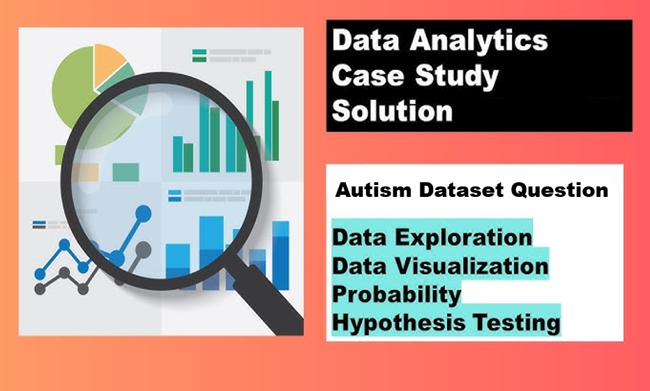
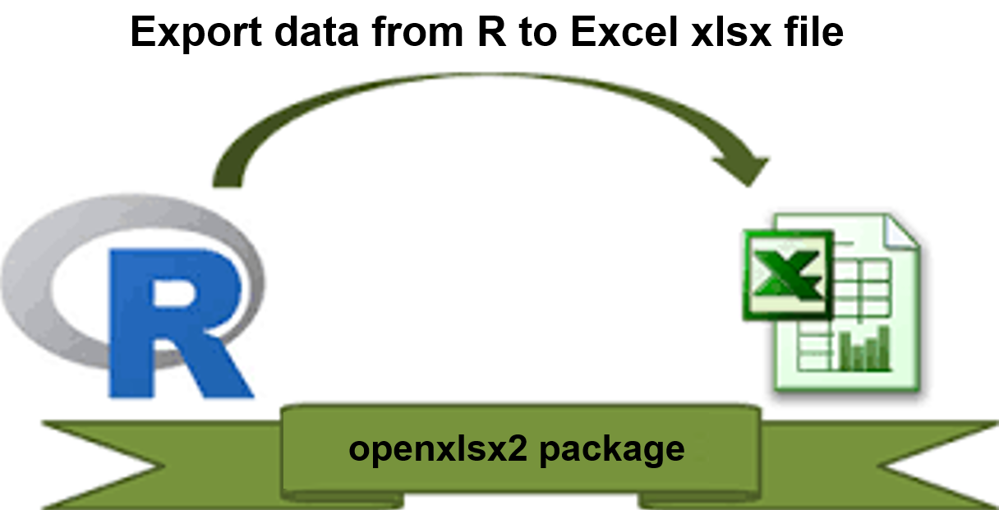
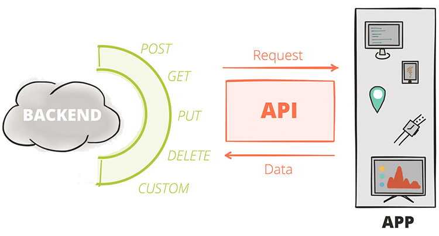
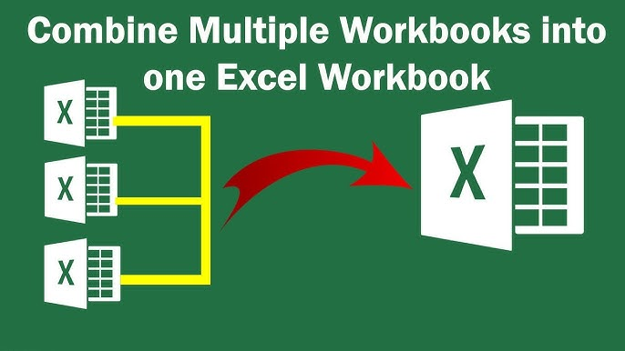
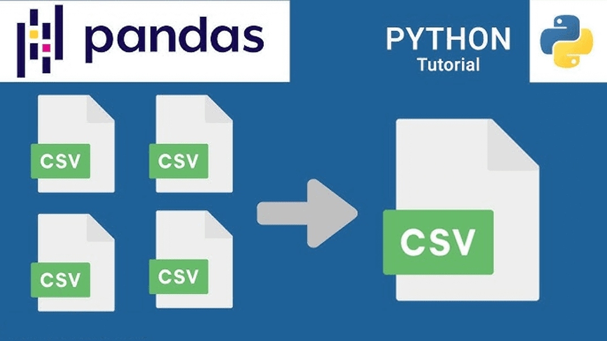

# Welcome to GBG Analytics Blog!

I am delighted to have you here. This blog covers various topics, offering insightful and engaging articles to inform and inspire. Feel free to browse around, and I would love to hear your thoughts. I hope you find the content both valuable and thought-provoking.

## 2024

October 24, 2024

[Statistics for Data Science and Analytics](../blog/statistics-for-datascience-and-analytics/index.llms.md)

This project analyzes a modified autism dataset of children's attributes, focusing on data preprocessing, univariate statistics, and visualizations. Structured as a Q&A tutorial, it guides users through data cleaning, descriptive statistics, visualizations, and hypothesis testing using R and Python. The goal is to explore and interpret the dataset, addressing key questions related to autism diagnosis and associated factors.

August 19, 2024

[Export Multiple Data Frames to Different Excel Worksheets in R](../blog/export-r-dataframe-to-excel-workbook/index.llms.md)

In this tutoral you will learn how to export multiple dataframes in R to an Excel workbook, with each Excel worksheet corresponding to a distint dataframe.

August 14, 2024

[How to fetch API data in R and Python](../blog/api-in-r-and-python/index.llms.md)

This tutorial will teach you how to fetch data from an external source using HTTP requests and parse the data into a usable format.

## 2023

November 10, 2022

[Data Consolidation: Automatically Merge Excel Sheets with Python](../blog/data-consolidation-excel/index.llms.md)

Learn how to dynamically consolidate data from multiple Excel sheets into a single pandas DataFrame using Python. This tutorial covers automating sheet retrieval, merging data efficiently, and tracking source sheets—all while simplifying your data processing workflow. Perfect for streamlining recurring reports and handling complex datasets!

October 20, 2022

[Data Consolidation: How to Efficiently Merge Multiple CSV Files in Python](../blog/data-consolidation-csv/index.llms.md)

In this quick tutorial, you'll learn how to easily merge several CSV files into one using Python. Whether you're working with a few small files or large datasets, this guide shows you how to use Pandas for simple tasks or \`Dask\` when your data is too big to handle. It's a practical, straightforward approach for anyone looking to combine CSV files efficiently.

Back to top
