[](dsn.jpg)

# Project Instructions

You will work with the `child.csv` file, which is a modified dataset adapted from the autism dataset available on [Kaggle](#). This dataset contains attributes/variables for several children who were tested for autism.

Your task is to perform the following data analysis activities using R and Python.

## Autism Data

To follow along with this tutorial, you can download the dataset in either Excel or CSV format by clicking the respective button.

  
[Figure 1](#fig-datadico) shows the data dictionary for the child autism dataset.

[](data_description.png "Figure 1: Data Dictionary for Child Autism Dataset")

Figure 1: Data Dictionary for Child Autism Dataset

### Required Packages for the Analysis

If you are following either the R or Python track, please ensure that the following packages are installed. When you see the 🐍 symbol, it indicates that Python is being used. The Ⓡ symbol represents examples where we use R.

## R Ⓡ

``` r
# Ensure your computer is connected to the internet!

library(tidyverse)
library(inspectdf)
library(gt)
library(patchwork)
library(gridExtra)
library(treemap)
library(kableExtra)
theme_set(theme_bw())
```

## Python 🐍

``` python
import numpy as np
from scipy import stats
import pandas as pd
import matplotlib.pyplot as plt
import seaborn as sns
import missingno as msno
from sklearn.linear_model import LinearRegression
```

# Data Preprocessing

In this data preprocessing step, we begin by importing the dataset and performing essential cleaning to ensure consistency. The process involves removing any extraneous whitespace and apostrophes from character columns, which helps in standardizing textual data. Additionally, categorical variables are created from relevant columns to optimize data organization and facilitate easier analysis. Finally, the levels of certain categorical variables, such as “autism” and “autismFH,” are reordered for meaningful interpretation in later analysis steps. This cleaning process ensures that the dataset is well-structured and ready for analysis.

## R Ⓡ

``` r
child_data <- read_csv("child.csv")

clean_data <- child_data %>%
  mutate(across(where(is.character), ~ str_squish(str_remove_all(., pattern = "'")))) %>%
  mutate(across(5:11, as.factor))

clean_data <- clean_data %>%
  mutate(
    autism = fct_relevel(autism, "YES"),
    autismFH = fct_relevel(autismFH, "yes")
  )
```

## Python🐍

``` python
# Load the dataset

child_data = pd.read_csv("child.csv")

# Clean the dataset by removing whitespace and apostrophes from character columns

clean_data = child_data.copy()

# Apply the transformations

clean_data = clean_data.apply(lambda x: x.str.replace("'", "").str.strip() if x.dtype == "object" else x)

# Convert columns 5 to 11 (0-indexed, meaning columns 4 to 10) to categorical

clean_data.iloc[:, 4:11] = clean_data.iloc[:, 4:11].astype('category')

# Reorder categorical levels for 'autism' and 'autismFH'

clean_data['autism'] = pd.Categorical(clean_data['autism'], categories=['YES', 'NO'], ordered=True)
clean_data['autismFH'] = pd.Categorical(clean_data['autismFH'], categories=['yes', 'no'], ordered=True)
```

The cleaned dataset for both Python and R is shown below:

> **Autism Dataset Overview**

| score | score2 | age | cost | gender | ethnicity | jaundice | autismFH | residence | relation | autism |
|:--:|:--:|:--:|:--:|:--:|:--:|:--:|:--:|:--:|:--:|:--:|
| 4.6 | 4.4 | 5 | 1170.0 | m | Others | no | no | Jordan | Parent | NO |
| 4.4 | 4.4 | 5 | 1090.0 | m | Middle Eastern | no | no | Jordan | Parent | NO |
| 4.8 | 4.3 | 5 | 1130.0 | m | NA | no | no | Jordan | NA | NO |
| 3.6 | 3.6 | 4 | 980.0 | f | NA | yes | no | Jordan | NA | NO |
| 9.7 | 9.5 | 4 | 2475.0 | m | Others | yes | no | United States | Parent | YES |
| 4.9 | 4.5 | 3 | 1315.0 | m | NA | no | yes | Egypt | NA | NO |
| 7.3 | 7.1 | 4 | 1815.0 | m | White-European | no | no | United Kingdom | Parent | YES |
| 7.5 | 7.1 | 4 | 1955.0 | f | Middle Eastern | no | no | Bahrain | Parent | YES |
| 6.7 | 6.4 | 2 | 1665.0 | f | Middle Eastern | no | no | Bahrain | Parent | YES |
| 5.9 | 6.2 | 2 | 1445.0 | f | NA | no | yes | Austria | NA | NO |
| 6.8 | 7.0 | 1 | 1760.0 | m | White-European | yes | no | United Kingdom | Self | YES |
| 3.6 | 3.5 | 4 | 880.0 | f | NA | no | no | Kuwait | NA | NO |
| 9.0 | 9.4 | 3 | 2300.0 | m | White-European | yes | no | United States | Parent | YES |
| 1.6 | 2.1 | 3 | 370.0 | f | Black | no | no | United Arab Emirates | Parent | NO |
| 15.0 | 14.0 | 5 | 3840.0 | m | White-European | no | no | Europe | Parent | YES |
| 10.0 | 10.0 | 7 | 3267.5 | m | White-European | no | no | Malta | Parent | YES |
| 8.5 | 8.7 | 3 | 2205.0 | m | South Asian | no | no | Bulgaria | Parent | YES |
| 0.5 | 0.0 | 6 | 2557.5 | m | Others | no | no | United States | Parent | NO |
| 7.5 | 8.0 | 2 | 1915.0 | m | White-European | no | yes | United States | Parent | YES |
| 7.7 | 8.1 | 4 | 1865.0 | m | NA | no | no | Egypt | NA | YES |
| 7.5 | 7.6 | 4 | 1875.0 | m | White-European | yes | no | South Africa | Parent | YES |
| 4.7 | 5.1 | 8 | 2830.0 | f | NA | no | no | Egypt | NA | NO |
| 2.4 | 1.9 | 3 | 660.0 | m | Asian | no | no | India | Parent | NO |
| 5.6 | 5.7 | 5 | 1470.0 | f | South Asian | no | no | India | Parent | NO |
| 7.8 | 8.0 | 2 | 1970.0 | m | NA | no | no | Egypt | NA | YES |
| 6.6 | 6.7 | 5 | 1620.0 | m | White-European | no | yes | United Kingdom | Relative | NO |
| 6.3 | 6.7 | 5 | 1515.0 | f | Middle Eastern | no | no | Afghanistan | Self | NO |
| 10.0 | 10.0 | 4 | 2560.0 | m | White-European | yes | no | United States | Parent | YES |
| 4.4 | 4.6 | 5 | 1190.0 | m | NA | no | yes | United Arab Emirates | NA | NO |
| 3.4 | 3.9 | 3 | 850.0 | f | Others | yes | yes | Georgia | Parent | NO |
| 10.0 | 10.0 | 2 | 2450.0 | m | White-European | no | no | United Kingdom | Parent | YES |
| 3.6 | 3.1 | 5 | 980.0 | m | Pasifika | yes | no | New Zealand | Parent | NO |
| 7.0 | 6.9 | 9 | 3025.0 | m | NA | no | no | Egypt | NA | YES |
| 5.8 | 6.0 | 4 | 1540.0 | m | South Asian | yes | no | India | Care professional | NO |
| 5.3 | 5.4 | 5 | 1325.0 | m | South Asian | yes | no | India | Parent | NO |
| 1.5 | 1.8 | 6 | 2625.0 | f | Middle Eastern | yes | no | Syria | Parent | NO |
| 3.0 | 3.4 | 3 | 780.0 | f | NA | no | no | Syria | NA | NO |
| 1.4 | 1.7 | 6 | 2627.5 | m | Asian | no | no | New Zealand | Parent | NO |
| 10.0 | 10.0 | 3 | 2510.0 | m | White-European | yes | no | United Kingdom | Parent | YES |
| 8.1 | 7.6 | 3 | 1965.0 | m | Asian | no | no | India | Parent | YES |
| 6.9 | 7.2 | 4 | 1725.0 | m | NA | yes | no | Jordan | NA | NO |
| 0.4 | 0.2 | 3 | 30.0 | m | Middle Eastern | no | no | Afghanistan | Parent | NO |
| 4.3 | 4.8 | 5 | 1045.0 | f | Middle Eastern | no | no | Jordan | Parent | NO |
| 7.6 | 7.5 | 3 | 1890.0 | f | NA | no | no | Jordan | NA | YES |
| 2.7 | 3.2 | 1 | 605.0 | m | Middle Eastern | no | no | Jordan | Parent | NO |
| 5.9 | 5.9 | 3 | 1535.0 | f | Middle Eastern | yes | no | Iraq | Relative | NO |
| 4.0 | 3.5 | 3 | 920.0 | f | Middle Eastern | yes | no | Iraq | Relative | NO |
| 6.5 | 6.0 | 5 | 1565.0 | m | NA | no | no | Jordan | NA | YES |
| 7.9 | 7.4 | 5 | 2055.0 | f | White-European | yes | no | New Zealand | Parent | YES |
| 2.0 | 1.5 | 6 | 2640.0 | m | Middle Eastern | no | yes | Jordan | Parent | NO |
| 3.8 | 3.4 | 6 | 2790.0 | m | NA | yes | no | Jordan | NA | NO |
| 6.1 | 6.5 | 3 | 1475.0 | m | Asian | no | no | India | Parent | NO |
| 5.6 | 6.0 | 5 | 1360.0 | m | NA | no | no | Jordan | NA | NO |
| 9.4 | 9.7 | 6 | 3192.5 | m | White-European | yes | no | United States | Parent | YES |
| 4.8 | 4.7 | 4 | 1280.0 | m | NA | no | no | United Arab Emirates | NA | NO |
| 1.9 | 2.3 | 4 | 485.0 | m | White-European | no | no | Australia | Parent | NO |
| 1.5 | 1.0 | 5 | 435.0 | m | NA | no | no | Saudi Arabia | NA | NO |
| 9.9 | 9.5 | 3 | 2505.0 | f | White-European | no | no | Georgia | Parent | YES |
| 8.3 | 8.6 | 8 | 3125.0 | f | Middle Eastern | no | no | Armenia | Care professional | YES |
| 7.3 | 6.8 | 3 | 1915.0 | m | Hispanic | no | yes | United States | Parent | YES |
| 3.7 | 3.5 | 3 | 925.0 | m | Turkish | no | no | Turkey | Relative | NO |
| 9.7 | 10.0 | 8 | 3227.5 | m | White-European | no | no | United States | Parent | YES |
| 6.5 | 6.0 | 3 | 1565.0 | f | White-European | yes | no | Australia | Parent | NO |
| 9.3 | 9.7 | 8 | 3175.0 | m | Asian | yes | no | Pakistan | Parent | YES |
| 4.4 | 4.2 | 7 | 2850.0 | m | Middle Eastern | no | no | United States | Parent | NO |
| 1.4 | 1.0 | 9 | 2587.5 | m | Middle Eastern | no | no | Jordan | Parent | NO |
| 3.0 | 3.0 | 3 | 710.0 | m | White-European | no | no | United Kingdom | Parent | NO |
| 4.1 | 4.3 | 3 | 1075.0 | m | White-European | no | no | United Kingdom | Parent | NO |
| 5.8 | 5.7 | 3 | 1410.0 | f | NA | no | yes | Pakistan | NA | NO |
| 9.7 | 9.8 | 3 | 2365.0 | m | White-European | no | yes | Canada | Parent | YES |
| 4.8 | 4.3 | 6 | 2867.5 | m | Asian | no | no | Oman | Parent | NO |
| 4.6 | 4.8 | 6 | 2822.5 | f | White-European | yes | no | United Kingdom | Parent | NO |
| 7.5 | 7.1 | 5 | 1825.0 | m | South Asian | no | no | India | Parent | YES |
| 8.3 | 8.0 | 4 | 2045.0 | f | Middle Eastern | no | no | Canada | Parent | YES |
| 6.8 | 6.7 | 7 | 3015.0 | f | Middle Eastern | no | yes | Canada | Parent | YES |
| 6.0 | 6.0 | 4 | 1490.0 | m | White-European | no | no | United Kingdom | Parent | NO |
| 9.7 | 10.0 | 2 | 2345.0 | f | Others | no | no | Canada | Parent | YES |
| 4.4 | 4.8 | 7 | 2820.0 | m | White-European | yes | no | New Zealand | Parent | NO |
| 9.1 | 8.9 | 3 | 2365.0 | m | Latino | no | yes | Brazil | Parent | YES |
| 5.9 | 6.0 | 6 | 2932.5 | m | White-European | yes | no | New Zealand | Parent | NO |
| 2.7 | 3.1 | 3 | 665.0 | m | White-European | no | no | New Zealand | Parent | NO |
| 9.2 | 9.3 | 6 | 3210.0 | m | White-European | yes | yes | New Zealand | Parent | YES |
| 8.3 | 8.0 | 7 | 3130.0 | m | White-European | no | no | United States | Parent | YES |
| 5.0 | 4.7 | 4 | 1210.0 | m | Asian | no | no | South Korea | Parent | NO |
| 6.0 | 5.8 | 3 | 1500.0 | m | Asian | no | no | India | Parent | NO |
| 9.2 | 9.4 | 2 | 2390.0 | f | White-European | no | no | United Kingdom | Parent | YES |
| 7.1 | 7.3 | 2 | 1735.0 | f | White-European | no | no | United Kingdom | Parent | YES |
| 10.0 | 10.0 | 3 | 2560.0 | m | White-European | no | no | South Africa | Parent | YES |
| 4.9 | 4.6 | 4 | 1135.0 | m | Latino | no | yes | Costa Rica | Parent | NO |
| 8.5 | 8.2 | 5 | 2105.0 | m | Hispanic | no | no | United States | Parent | YES |
| 8.3 | 8.7 | 3 | 2045.0 | f | White-European | no | no | Australia | Parent | YES |
| 5.2 | 5.4 | 2 | 1310.0 | f | White-European | yes | yes | United Kingdom | Relative | NO |
| 7.6 | 7.3 | 4 | 1850.0 | m | Asian | no | no | India | Parent | YES |
| 8.7 | 8.5 | 4 | 2255.0 | m | Asian | no | no | India | Parent | YES |
| 10.0 | 10.0 | 5 | 2530.0 | m | Latino | no | no | United States | Parent | YES |
| 7.1 | 7.3 | 6 | 3052.5 | m | Hispanic | no | no | United States | Parent | YES |
| 8.6 | 8.5 | 2 | 2200.0 | m | White-European | no | no | Sweden | Parent | YES |
| 8.5 | 8.1 | 3 | 2065.0 | m | White-European | no | no | Australia | Parent | YES |
| 8.3 | 8.8 | 3 | 2145.0 | m | White-European | no | yes | United States | Parent | YES |
| 1.9 | 1.4 | 6 | 2635.0 | m | White-European | no | yes | United States | Parent | NO |
| 6.3 | 6.3 | 2 | 1505.0 | f | White-European | yes | yes | United Kingdom | Relative | NO |
| 7.8 | 8.2 | 5 | 2030.0 | f | Asian | no | no | Philippines | Parent | YES |
| 2.9 | 2.9 | 8 | 2740.0 | f | White-European | no | no | United Kingdom | Parent | NO |
| 4.7 | 4.4 | 1 | 1105.0 | m | Others | no | no | United States | Relative | NO |
| 4.4 | 4.1 | 3 | 1110.0 | m | Asian | no | yes | Malaysia | Parent | NO |
| 8.2 | 8.6 | 3 | 2040.0 | m | Asian | yes | no | Philippines | Parent | YES |
| 8.2 | 8.7 | 1 | 2050.0 | m | White-European | yes | no | United Kingdom | Parent | YES |
| 2.4 | 2.5 | 3 | 640.0 | f | White-European | yes | yes | United Kingdom | Parent | NO |
| 4.8 | 4.6 | 2 | 1190.0 | m | Asian | no | no | Argentina | Parent | NO |
| 3.1 | 3.6 | 6 | 2732.5 | m | Asian | no | no | Japan | Parent | NO |
| 6.4 | 6.0 | 4 | 1520.0 | m | NA | no | no | Syria | NA | YES |
| 3.9 | 4.3 | 3 | 955.0 | f | White-European | no | no | United States | Parent | NO |
| 7.1 | 7.2 | 7 | 3012.5 | m | White-European | no | no | United States | Parent | YES |
| 9.7 | 9.8 | 3 | 2435.0 | m | White-European | no | no | Australia | Parent | YES |
| 6.1 | 6.0 | 3 | 1435.0 | m | South Asian | no | no | India | Parent | NO |
| 10.0 | 10.0 | 2 | 2500.0 | m | Asian | yes | no | India | Relative | YES |
| 9.6 | 9.6 | 1 | 2460.0 | f | Asian | no | no | United States | Parent | YES |
| 6.6 | 6.6 | 5 | 1600.0 | f | White-European | no | no | United States | Parent | NO |
| 6.5 | 6.8 | 3 | 1645.0 | m | Asian | no | no | Bangladesh | Relative | NO |
| 4.2 | 4.1 | 3 | 1110.0 | m | Asian | no | yes | Bangladesh | Parent | NO |
| 7.8 | 7.8 | 3 | 1910.0 | m | Asian | no | no | Bangladesh | Relative | YES |
| 4.5 | 4.1 | 1 | 1155.0 | m | White-European | no | no | United States | Parent | NO |
| 9.8 | 10.0 | 6 | 3230.0 | m | White-European | no | no | United Kingdom | Relative | YES |
| 5.1 | 5.2 | 3 | 1285.0 | m | NA | yes | no | Qatar | NA | NO |
| 8.8 | 9.0 | 5 | 2280.0 | f | White-European | yes | no | Ireland | Parent | YES |
| 8.4 | 8.0 | 4 | 2070.0 | m | Asian | no | no | India | Parent | YES |
| 6.8 | 7.2 | 9 | 3010.0 | m | NA | yes | no | Jordan | NA | YES |
| 7.9 | 8.3 | 3 | 1915.0 | f | Asian | yes | no | United Kingdom | Parent | YES |
| 6.5 | 6.9 | 8 | 2985.0 | m | Asian | no | no | India | Parent | NO |
| 7.6 | 7.5 | 3 | 1860.0 | f | White-European | yes | no | United States | Parent | YES |
| 9.2 | 9.2 | 1 | 2300.0 | m | White-European | no | no | New Zealand | Parent | YES |
| 4.0 | 3.6 | 8 | 2792.5 | m | White-European | no | no | New Zealand | Parent | NO |
| 5.9 | 6.3 | 4 | 1565.0 | m | White-European | yes | yes | United Kingdom | Parent | NO |
| 5.9 | 6.4 | 3 | 1475.0 | f | Black | no | no | Canada | Parent | NO |
| 9.8 | 10.0 | 3 | 2500.0 | m | White-European | no | yes | United Kingdom | Parent | YES |
| 4.4 | 4.8 | 5 | 1100.0 | m | White-European | no | no | Romania | Parent | NO |
| 6.9 | 7.1 | 3 | 1695.0 | f | White-European | yes | no | United Kingdom | Parent | YES |
| 0.0 | 0.2 | 4 | -30.0 | f | Hispanic | no | no | United States | Parent | NO |
| 5.6 | 5.1 | 9 | 2927.5 | m | NA | yes | no | Qatar | NA | NO |
| 10.0 | 10.0 | 8 | 3250.0 | m | White-European | yes | yes | United Kingdom | Parent | YES |
| 7.6 | 7.3 | 6 | 3077.5 | f | White-European | no | no | Australia | Parent | YES |
| 6.5 | 6.4 | 1 | 1665.0 | f | White-European | no | no | Netherlands | Parent | NO |
| 6.5 | 6.9 | 3 | 1635.0 | m | South Asian | no | no | India | Parent | YES |
| 7.9 | 8.4 | 3 | 2065.0 | m | Asian | no | no | India | Relative | YES |
| 6.9 | 6.4 | 6 | 3010.0 | f | White-European | no | no | United Kingdom | Parent | NO |
| 8.4 | 8.5 | 3 | 2060.0 | m | Black | yes | no | United States | Parent | YES |
| 5.8 | 6.0 | 3 | 1460.0 | m | NA | yes | no | Lebanon | NA | NO |
| 8.5 | 8.3 | 1 | 2165.0 | m | White-European | no | no | Germany | Care professional | YES |
| 5.8 | 6.2 | 3 | 1520.0 | m | Asian | no | no | India | Parent | NO |
| 3.5 | 3.6 | 3 | 865.0 | m | NA | no | no | Latvia | NA | NO |
| 6.9 | 6.4 | 3 | 1635.0 | m | South Asian | no | yes | Saudi Arabia | Parent | YES |
| 7.6 | 7.2 | 3 | 1910.0 | m | Black | no | yes | United States | Parent | YES |
| 6.5 | 6.1 | 6 | 3000.0 | m | White-European | yes | no | United States | Parent | NO |
| 9.3 | 9.3 | 3 | 2255.0 | m | White-European | no | no | United States | Parent | YES |
| 8.8 | 9.3 | 4 | 2200.0 | f | White-European | no | no | New Zealand | Parent | YES |
| 9.8 | 9.5 | 5 | 2480.0 | m | Others | yes | no | United Kingdom | Parent | YES |
| 6.3 | 6.4 | 5 | 1585.0 | f | Asian | no | no | United Kingdom | Parent | NO |
| 7.6 | 7.9 | 5 | 1870.0 | f | White-European | no | yes | United Kingdom | Parent | YES |
| 7.2 | 7.4 | 8 | 3052.5 | m | White-European | no | yes | United Kingdom | Parent | YES |
| 10.0 | 10.0 | 7 | 3265.0 | m | White-European | no | no | United Kingdom | Parent | YES |
| 7.5 | 7.2 | 2 | 1955.0 | m | NA | no | no | Jordan | NA | YES |
| 7.0 | 7.4 | 8 | 3030.0 | m | White-European | no | no | Australia | Parent | YES |
| 2.7 | 3.1 | 8 | 2692.5 | f | White-European | no | yes | United Kingdom | Parent | NO |
| 7.1 | 7.1 | 6 | 3052.5 | m | Black | no | no | United States | Parent | YES |
| 4.3 | 3.9 | 3 | 1025.0 | m | Asian | no | no | India | Relative | NO |
| 5.1 | 5.5 | 1 | 1235.0 | f | Others | no | no | Australia | Self | NO |
| 3.4 | 3.3 | 7 | 2770.0 | m | Middle Eastern | no | no | United Arab Emirates | Parent | NO |
| 8.5 | 8.3 | 5 | 2145.0 | m | Others | no | no | Australia | Parent | YES |
| 8.3 | 7.8 | 7 | 3120.0 | m | NA | yes | no | Russia | NA | YES |
| 9.1 | 8.9 | 2 | 2285.0 | f | White-European | no | no | Austria | Parent | YES |
| 5.1 | 5.3 | 4 | 1265.0 | f | White-European | no | no | Italy | Parent | NO |
| 3.5 | 3.6 | 3 | 945.0 | f | White-European | no | yes | Australia | Relative | NO |
| 10.0 | 10.0 | 2 | 2550.0 | m | White-European | no | no | Australia | Parent | YES |
| 5.5 | 5.9 | 2 | 1285.0 | f | Others | yes | no | United Kingdom | Self | NO |
| 5.3 | 5.0 | 3 | 1315.0 | m | NA | yes | no | Qatar | NA | NO |
| 4.1 | 4.2 | 7 | 2805.0 | m | White-European | no | no | United Kingdom | Parent | NO |
| 3.4 | 2.9 | 7 | 2735.0 | m | White-European | no | no | United Kingdom | Parent | NO |
| 9.7 | 9.5 | 8 | 3212.5 | m | White-European | no | no | United Kingdom | Parent | YES |
| 3.8 | 4.3 | 3 | 990.0 | m | Asian | no | no | Bangladesh | Parent | NO |
| 6.9 | 6.6 | 3 | 1785.0 | m | Asian | no | no | Bangladesh | Parent | YES |
| 8.3 | 8.4 | 3 | 2095.0 | f | NA | yes | no | China | NA | YES |
| 3.8 | 3.5 | 3 | 1020.0 | f | NA | no | no | Pakistan | NA | NO |
| 8.5 | 8.5 | 2 | 2125.0 | m | Hispanic | no | no | United States | Self | YES |
| 5.7 | 5.8 | 1 | 1335.0 | f | Asian | no | no | Australia | Parent | NO |
| 7.9 | 8.1 | 2 | 1985.0 | m | Asian | no | no | India | Parent | YES |
| 5.5 | 5.6 | 3 | 1455.0 | m | Black | yes | no | United Kingdom | Parent | NO |
| 7.9 | 7.4 | 3 | 1935.0 | m | White-European | yes | no | United States | Parent | YES |
| 9.5 | 9.4 | 5 | 2395.0 | f | Black | no | no | Nigeria | Parent | YES |
| 5.5 | 5.0 | 7 | 2905.0 | m | White-European | no | no | United Kingdom | Parent | NO |
| 9.1 | 9.5 | 3 | 2335.0 | f | White-European | no | yes | Australia | Parent | YES |
| 7.9 | 7.5 | 3 | 1975.0 | m | NA | no | no | Lebanon | NA | YES |
| 7.7 | 7.9 | 7 | 3070.0 | m | White-European | no | no | Armenia | Parent | YES |
| 6.8 | 7.1 | 2 | 1660.0 | m | Hispanic | no | no | United States | Relative | YES |
| 6.6 | 6.8 | 3 | 1650.0 | f | White-European | yes | yes | United Kingdom | Parent | NO |
| 4.9 | 4.7 | 4 | 1255.0 | m | NA | no | no | Iraq | NA | NO |
| 2.6 | 2.7 | 3 | 620.0 | m | White-European | no | no | U.S. Outlying Islands | Parent | NO |
| 7.4 | 7.2 | 7 | 3047.5 | m | Black | no | no | Australia | Parent | YES |
| 6.6 | 6.5 | 3 | 1600.0 | m | Pasifika | no | no | New Zealand | Care professional | YES |
| 9.5 | 9.9 | 3 | 2385.0 | m | South Asian | no | no | India | Parent | YES |
| 3.9 | 3.8 | 8 | 2787.5 | m | White-European | no | yes | Australia | Parent | NO |
| 3.4 | 3.6 | 8 | 2772.5 | m | White-European | yes | yes | Australia | Parent | NO |
| 8.5 | 8.1 | 3 | 2065.0 | f | White-European | no | yes | United Kingdom | Parent | YES |
| 4.4 | 4.7 | 4 | 1020.0 | m | South Asian | no | no | India | Relative | NO |
| 7.4 | 7.5 | 6 | 3052.5 | f | Asian | yes | no | India | Parent | YES |
| 7.7 | 7.4 | 3 | 1975.0 | f | White-European | yes | no | United Kingdom | Parent | YES |
| 5.1 | 5.2 | 4 | 1185.0 | f | White-European | no | no | United Kingdom | Parent | NO |
| 8.7 | 9.2 | 5 | 2185.0 | m | Asian | no | no | Nepal | Care professional | YES |
| 9.9 | 10.0 | 7 | 3252.5 | m | White-European | no | no | United Kingdom | Parent | YES |
| 3.9 | 4.4 | 3 | 925.0 | m | Asian | no | no | Bangladesh | Parent | NO |
| 6.5 | 6.1 | 4 | 1665.0 | m | Latino | no | yes | Mexico | Parent | NO |
| 6.9 | 7.1 | 4 | 1785.0 | m | Latino | no | yes | Mexico | Parent | YES |
| 6.1 | 5.6 | 5 | 1445.0 | m | White-European | yes | no | United States | Parent | NO |
| 5.8 | 6.2 | 3 | 1400.0 | m | NA | yes | no | Malaysia | NA | NO |
| 6.7 | 6.4 | 7 | 3015.0 | m | White-European | no | no | United Kingdom | Parent | NO |
| 5.5 | 5.8 | 4 | 1375.0 | m | South Asian | no | no | India | Parent | NO |
| 9.8 | 9.5 | 3 | 2440.0 | f | Asian | no | yes | United States | Parent | YES |
| 8.7 | 9.1 | 5 | 2165.0 | m | White-European | no | no | Australia | Parent | YES |
| 0.4 | 0.0 | 2 | 150.0 | m | Turkish | no | yes | Turkey | Parent | NO |
| 2.5 | 2.5 | 5 | 665.0 | m | Others | no | no | United Kingdom | Parent | NO |
| 9.0 | 8.6 | 3 | 2160.0 | f | Hispanic | no | no | United States | Parent | YES |
| 10.0 | 9.8 | 7 | 3262.5 | m | White-European | no | no | United States | Parent | YES |
| 7.8 | 7.6 | 3 | 1970.0 | m | White-European | no | yes | United States | Parent | YES |
| 7.6 | 7.8 | 3 | 1870.0 | m | White-European | no | no | United States | Parent | YES |
| 8.2 | 8.1 | 5 | 1990.0 | m | White-European | no | no | United States | Parent | YES |
| 3.5 | 4.0 | 7 | 2775.0 | m | White-European | yes | no | Canada | Care professional | NO |
| 10.0 | 9.8 | 8 | 3260.0 | m | Black | yes | no | United Kingdom | Parent | YES |
| 4.2 | 3.7 | 7 | 2795.0 | f | South Asian | no | no | India | Parent | NO |
| 7.5 | 7.9 | 4 | 1825.0 | m | South Asian | no | no | India | Parent | YES |
| 3.7 | 4.2 | 4 | 885.0 | m | Middle Eastern | no | no | Jordan | Care professional | NO |
| 8.1 | 8.4 | 3 | 2005.0 | m | Asian | yes | no | Isle of Man | Care professional | YES |
| 8.7 | 9.0 | 1 | 2185.0 | m | White-European | no | no | United States | Parent | YES |
| 5.7 | 6.1 | 3 | 1475.0 | m | NA | yes | no | Libya | NA | NO |
| 6.9 | 7.3 | 3 | 1735.0 | m | NA | yes | no | Libya | NA | YES |
| 8.2 | 8.4 | 4 | 1990.0 | m | NA | no | no | Russia | NA | YES |
| 5.3 | 5.0 | 3 | 1385.0 | m | Others | yes | no | Libya | Parent | NO |
| 6.0 | 6.0 | 4 | 1520.0 | m | NA | no | no | Russia | NA | NO |
| 8.6 | 8.6 | 6 | 3160.0 | f | Asian | no | no | Philippines | Parent | YES |
| 5.5 | 5.5 | 2 | 1345.0 | f | Latino | yes | no | Philippines | Care professional | NO |
| 5.0 | 5.2 | 2 | 1260.0 | m | Asian | no | no | India | Parent | NO |
| 5.9 | 5.9 | 2 | 1515.0 | f | White-European | no | yes | Australia | Parent | NO |
| 6.9 | 6.6 | 8 | 3005.0 | m | South Asian | no | no | New Zealand | Parent | NO |
| 5.9 | 6.3 | 5 | 1485.0 | m | South Asian | yes | no | India | Parent | NO |
| 2.5 | 2.2 | 5 | 625.0 | m | NA | yes | no | Saudi Arabia | NA | NO |
| 2.7 | 2.7 | 8 | 2712.5 | f | NA | yes | no | Saudi Arabia | NA | NO |
| 6.0 | 5.9 | 6 | 2967.5 | m | NA | yes | no | Jordan | NA | NO |
| 5.7 | 6.2 | 4 | 1515.0 | m | Middle Eastern | no | no | Jordan | Parent | NO |
| 4.6 | 4.6 | 4 | 1110.0 | m | Middle Eastern | yes | no | United Arab Emirates | Parent | NO |
| 1.8 | 2.0 | 1 | 370.0 | m | Middle Eastern | no | yes | United Arab Emirates | Parent | NO |
| 3.6 | 4.1 | 6 | 2787.5 | m | Middle Eastern | no | no | Jordan | Parent | NO |
| 6.1 | 6.1 | 8 | 2947.5 | m | NA | yes | no | Egypt | NA | NO |
| 6.5 | 6.0 | 6 | 2990.0 | m | Middle Eastern | yes | no | Egypt | Parent | YES |
| 8.0 | 8.0 | 6 | 3082.5 | m | NA | yes | no | Egypt | NA | YES |
| 7.9 | 7.4 | 6 | 3092.5 | m | Middle Eastern | yes | no | Jordan | Parent | YES |
| 8.8 | 9.1 | 8 | 3177.5 | f | Middle Eastern | no | no | Egypt | Parent | YES |
| 4.9 | 5.4 | 4 | 1145.0 | m | Middle Eastern | yes | no | United Arab Emirates | Parent | NO |
| 4.6 | 4.3 | 3 | 1090.0 | m | South Asian | no | no | India | Parent | NO |
| 4.2 | 4.0 | 4 | 1090.0 | m | Asian | no | yes | India | Parent | NO |
| 10.0 | 10.0 | 3 | 2580.0 | f | South Asian | no | no | Armenia | Care professional | YES |
| 4.4 | 4.2 | 4 | 1140.0 | m | South Asian | no | no | India | Parent | NO |
| 8.3 | 8.4 | 4 | 2145.0 | m | Black | no | no | United States | Parent | YES |
| 5.7 | 5.4 | 3 | 1415.0 | m | White-European | no | no | Italy | Parent | NO |
| 4.9 | 4.7 | 5 | 1205.0 | m | Asian | no | no | India | Parent | NO |
| 10.0 | 10.0 | 5 | 2490.0 | f | Black | no | no | Canada | Parent | YES |
| 6.0 | 6.3 | 4 | 1580.0 | m | Asian | no | no | India | Relative | NO |
| 7.5 | 7.2 | 2 | 1855.0 | m | White-European | no | no | United Kingdom | Parent | YES |
| 8.8 | 9.1 | 1 | 2180.0 | m | Black | yes | no | India | Parent | YES |
| 5.2 | 4.8 | 3 | 1360.0 | m | South Asian | no | no | India | Parent | NO |
| 8.5 | 8.1 | 4 | 2175.0 | m | Others | no | no | United Kingdom | Parent | YES |
| 7.0 | 6.9 | 1 | 1740.0 | m | NA | yes | no | Pakistan | NA | YES |
| 3.6 | 4.0 | 8 | 2780.0 | m | Middle Eastern | yes | no | New Zealand | Parent | NO |
| 7.5 | 7.1 | 3 | 1925.0 | m | Asian | no | no | India | Parent | YES |
| 2.7 | 2.6 | 3 | 685.0 | f | White-European | no | yes | United Kingdom | Parent | NO |
| 3.6 | 3.9 | 4 | 990.0 | m | Black | no | no | Ghana | Parent | NO |
| 9.0 | 8.8 | 7 | 3195.0 | m | White-European | no | yes | Australia | Parent | YES |
| 9.2 | 9.6 | 7 | 3175.0 | m | White-European | yes | no | United States | Parent | YES |
| 4.0 | 4.4 | 5 | 990.0 | m | Asian | no | no | India | Care professional | NO |
| 6.0 | 6.5 | 2 | 1490.0 | m | Asian | no | no | India | Parent | NO |
| 7.5 | 7.0 | 1 | 1895.0 | f | Asian | no | no | India | Parent | YES |
| 4.7 | 4.8 | 5 | 1175.0 | f | White-European | no | no | United Kingdom | Parent | NO |
| 9.3 | 9.3 | 5 | 2405.0 | m | Asian | no | yes | India | Parent | YES |
| 2.5 | 2.4 | 3 | 535.0 | m | Black | no | yes | India | Parent | NO |
| 6.6 | 6.5 | 3 | 1600.0 | m | White-European | no | no | Australia | Parent | NO |
| 6.5 | 6.1 | 3 | 1635.0 | f | White-European | yes | no | United Kingdom | Parent | NO |
| 4.9 | 5.1 | 4 | 1305.0 | m | Others | no | no | United States | Parent | NO |
| 6.0 | 5.7 | 1 | 1530.0 | f | White-European | no | no | Australia | Care professional | NO |
| 8.9 | 9.0 | 1 | 2135.0 | f | White-European | no | no | Australia | Care professional | YES |
| 9.0 | 8.8 | 4 | 2340.0 | f | Latino | yes | no | Bhutan | Parent | YES |
| 9.7 | 10.0 | 6 | 3230.0 | f | White-European | yes | yes | United Kingdom | Parent | YES |
| 3.6 | 4.1 | 6 | 2747.5 | f | White-European | yes | yes | Australia | Parent | NO |
| 7.0 | 7.5 | 3 | 1840.0 | m | Latino | no | no | Brazil | Parent | YES |
| 9.6 | 9.9 | 3 | 2490.0 | m | South Asian | no | no | India | Parent | YES |
| 3.7 | 4.1 | 3 | 925.0 | f | South Asian | no | no | India | Parent | NO |

Cleaned Data {.table .table-striped .table-hover .table-condensed .caption-top .table-sm .small}

## R Ⓡ

``` r
clean_data %>%
  inspect_na() %>%
  show_plot()
```

[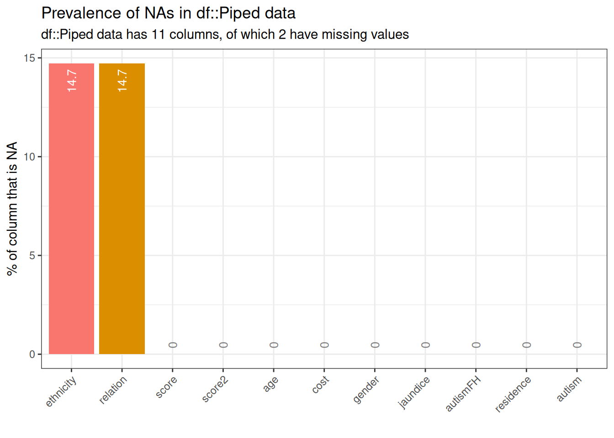](index_files/figure-html/unnamed-chunk-6-1.png)

## Python 🐍

``` python
msno.matrix(clean_data)
plt.show()
```

[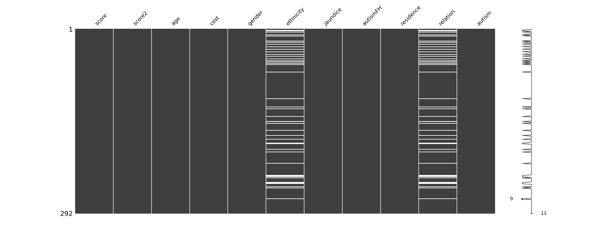](index_files/figure-html/unnamed-chunk-7-1.png)

# Question 1

Produce a plot showing the relative proportion of children residing in Australia, Germany, Italy, and India. Provide comments on your visualization and suggest an alternative plot that could represent this data, noting its advantages. There is no need to create the alternative plot.

## Solution

## R Ⓡ

``` r
question1 <- clean_data %>%
  filter(residence %in% c("Australia", "Germany", "Italy", "India")) %>%
  count(residence) %>%
  mutate(prop = n / sum(n))

question1 %>%
  gt() %>%
  tab_spanner(label = "Statistics", columns = vars(n, prop))
```

[TABLE]

``` r
question1 %>%
  ggplot(aes(x = reorder(residence, prop), y = prop, fill = residence)) +
  geom_col(width = 0.5, show.legend = FALSE) +
  theme_bw() +
  labs(x = "Residence", y = "Relative Proportion") +
  scale_y_continuous(labels = scales::percent)
```

[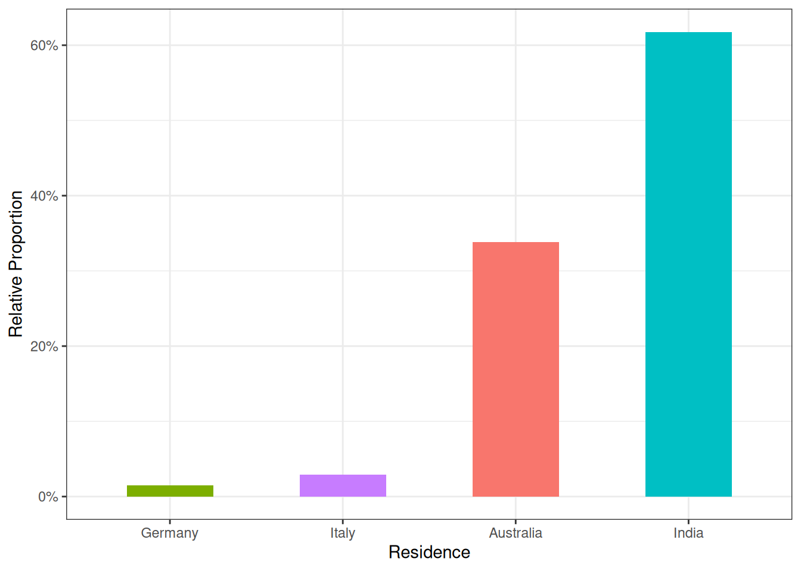](index_files/figure-html/unnamed-chunk-8-3.png)

## Python 🐍

``` python
# Filter and calculate counts and proportions
question1 = clean_data[clean_data['residence'].isin(['Australia', 'Germany', 'Italy', 'India'])]

question1 = question1.groupby('residence').size().reset_index(name='n')
question1['prop'] = question1['n'] / question1['n'].sum()

# Display the table
print(question1)
```

    #>    residence   n      prop
    #> 0  Australia  23  0.338235
    #> 1    Germany   1  0.014706
    #> 2      India  42  0.617647
    #> 3      Italy   2  0.029412

``` python

# Plot the relative proportions
plt.figure(figsize=(8, 6))
sns.barplot(x='residence', y='prop', data=question1, order=question1.sort_values('prop')['residence'], palette='Set2')

# Customizing the plot
plt.xlabel('Residence')
plt.ylabel('Relative Proportion')
plt.ylim(0, 1);

plt.gca().yaxis.set_major_formatter(plt.FuncFormatter(lambda x, _: f'{x:.0%}'))  # Format y-axis as percentage
plt.title('Relative Proportion by Residence')
```

[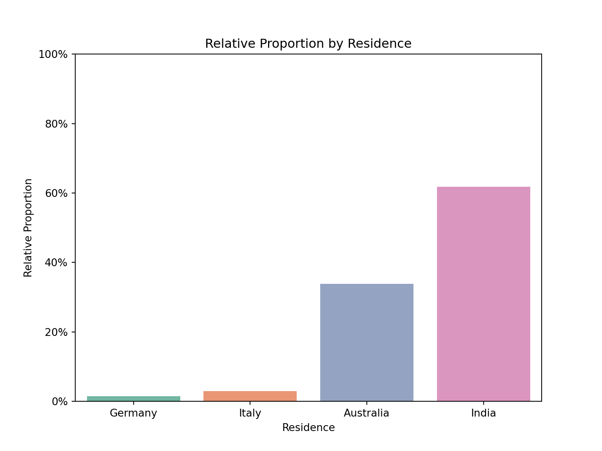](index_files/figure-html/unnamed-chunk-9-1.png)

The visualization indicates that most children in this subset reside in India. An alternative visualization could be a pie chart.

**Advantages of a Pie Chart:**

- Simple and easy to interpret
- Visually clear, especially with few categories
- Ideal for presenting proportions

# Question 2

Use univariate statistics to describe at least the first four attributes. Discuss any notable results, and use visualizations where appropriate.

## Solution

## R Ⓡ

``` r
# Univariate statistics for score, age, cost, gender, jaundice, and autism
variables_of_interest <- c("score", "age", "cost", "gender", "jaundice", "autism")

# Summary statistics
summary_stats <- clean_data %>%
  select(all_of(variables_of_interest)) %>%
  summary()

# Visualizations for numerical variables: score, age, and cost
g1 <- ggplot(clean_data, aes(x = score)) +
  geom_histogram(binwidth = 0.5, fill = "blue", color = "black") +
  labs(title = "Distribution of Score")

g2 <- ggplot(child_data, aes(x = age)) +
  geom_histogram(binwidth = 0.5, fill = "green", color = "black") +
  labs(title = "Distribution of Age")

g3 <- ggplot(child_data, aes(x = cost)) +
  geom_histogram(binwidth = 50, fill = "purple", color = "black") +
  labs(title = "Distribution of Cost")

# Arrange plots together
grid.arrange(g1, g2, g3, ncol = 3)
```

[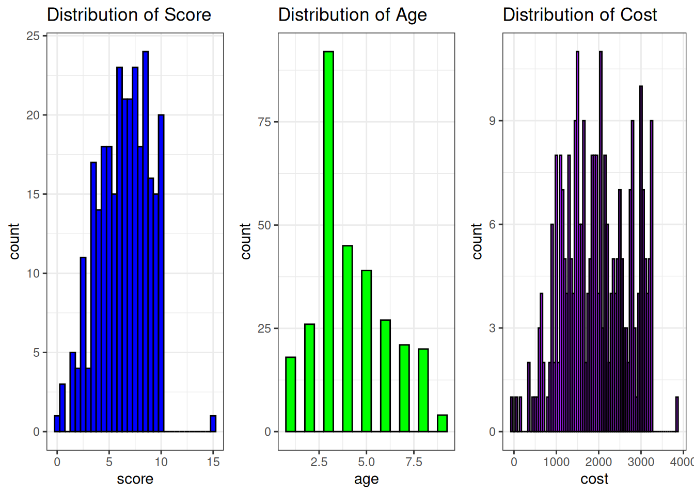](index_files/figure-html/unnamed-chunk-10-3.png)

``` r
# Categorical visualizations: gender, jaundice, and autism

g4 <- ggplot(clean_data, aes(x = gender)) +
  geom_bar(fill = "lightblue") +
  labs(title = "Gender Distribution")

g5 <- ggplot(child_data, aes(x = jaundice)) +
  geom_bar(fill = "orange") +
  labs(title = "Jaundice Distribution")

g6 <- ggplot(child_data, aes(x = autism)) +
  geom_bar(fill = "red") +
  labs(title = "Autism Distribution")

# Arrange plots together
grid.arrange(g4, g5, g6, ncol = 3)
```

[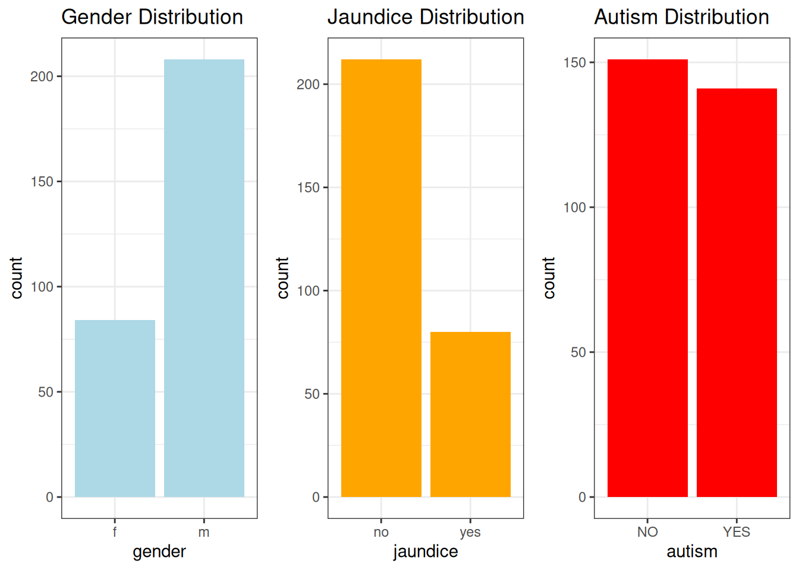](index_files/figure-html/unnamed-chunk-10-4.png)

``` r
# Display the summary statistics for interpretation
print(summary_stats)
```

    #>      score             age             cost      gender  jaundice  autism   
    #>  Min.   : 0.000   Min.   :1.000   Min.   : -30   f: 84   no :212   YES:141  
    #>  1st Qu.: 4.600   1st Qu.:3.000   1st Qu.:1360   m:208   yes: 80   NO :151  
    #>  Median : 6.500   Median :4.000   Median :1920                              
    #>  Mean   : 6.394   Mean   :4.199   Mean   :1951                              
    #>  3rd Qu.: 8.300   3rd Qu.:5.000   3rd Qu.:2565                              
    #>  Max.   :15.000   Max.   :9.000   Max.   :3840

## Python 🐍

``` python
# Univariate statistics for score, age, cost, gender, jaundice, and autism
variables_of_interest = ['score', 'age', 'cost', 'gender', 'jaundice', 'autism']

# Summary statistics
summary_stats = clean_data[variables_of_interest].describe(include='all')

# Visualizations for numerical variables: score, age, and cost
fig, axes = plt.subplots(1, 3, figsize=(18, 6))

# Plot for score
sns.histplot(clean_data['score'], bins=10, kde=True, ax=axes[0], color='blue')
axes[0].set_title('Distribution of Score')

# Plot for age
sns.histplot(clean_data['age'], bins=10, kde=True, ax=axes[1], color='green')
axes[1].set_title('Distribution of Age')

# Plot for cost
sns.histplot(clean_data['cost'], bins=10, kde=True, ax=axes[2], color='purple')
axes[2].set_title('Distribution of Cost')

plt.tight_layout()
plt.show()
```

[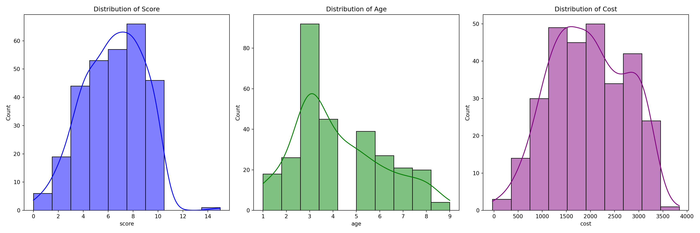](index_files/figure-html/unnamed-chunk-11-1.png)

``` python
# Categorical visualizations: gender, jaundice, and autism
fig, axes = plt.subplots(1, 3, figsize=(18, 6))

# Gender count plot
sns.countplot(x='gender', data=child_data, ax=axes[0], palette='Set2')
axes[0].set_title('Gender Distribution')

# Jaundice count plot
sns.countplot(x='jaundice', data=clean_data, ax=axes[1], palette='Set3')
axes[1].set_title('Jaundice Distribution')

# Autism count plot
sns.countplot(x='autism', data=clean_data, ax=axes[2], palette='Set1')
axes[2].set_title('Autism Distribution')

plt.tight_layout()
plt.show()
```

[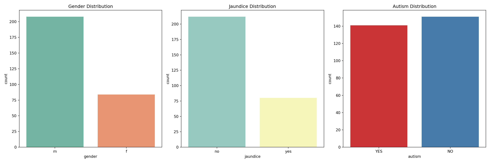](index_files/figure-html/unnamed-chunk-11-2.png)

``` python
# Display the summary statistics for interpretation
print(summary_stats)
```

    #>              score        age         cost gender jaundice autism
    #> count   292.000000  292.00000   292.000000    292      292    292
    #> unique         NaN        NaN          NaN      2        2      2
    #> top            NaN        NaN          NaN      m       no     NO
    #> freq           NaN        NaN          NaN    208      212    151
    #> mean      6.394178    4.19863  1951.241438    NaN      NaN    NaN
    #> std       2.393117    1.94643   778.200367    NaN      NaN    NaN
    #> min       0.000000    1.00000   -30.000000    NaN      NaN    NaN
    #> 25%       4.600000    3.00000  1360.000000    NaN      NaN    NaN
    #> 50%       6.500000    4.00000  1920.000000    NaN      NaN    NaN
    #> 75%       8.300000    5.00000  2565.000000    NaN      NaN    NaN
    #> max      15.000000    9.00000  3840.000000    NaN      NaN    NaN

**Interpretation of the Charts**

1.  **Score**:  
    The mean score for children in the dataset was 6.39 (SD = 2.39), with scores ranging from 0 to 9.7. The distribution of scores appears to be relatively uniform, with the majority of children scoring between 4 and 8. This suggests that the children in the sample exhibited mid-range scores, and there were no extreme outliers or significant deviations. The presence of a wide range of scores could indicate variability in the underlying factor being measured by the score.

2.  **Age**:  
    The mean age of the children in the dataset was 4.2 years (SD = 1.95), with ages ranging from 1 to 10 years. The distribution of ages was skewed towards younger children, with a concentration of children aged between 3 and 5 years. This skewness suggests that the dataset predominantly consists of younger children, with a possible overrepresentation of early childhood ages compared to older children.

3.  **Cost**:  
    The cost data had a mean of 1951.24 (SD = 778.20), with a range from -30 to 5000. There were some negative values in the dataset, which may indicate data entry errors or special cases, requiring further investigation. The distribution also showed outliers at the higher end of the cost range, suggesting that some families may face significantly higher costs than the majority, indicating potential financial disparities.

4.  **Gender**:  
    The gender distribution indicated that 61.6% of the children were male, and 38.4% were female. This imbalance suggests that there may be a slight overrepresentation of males in the dataset (e.g., male children = 61.6%, female children = 38.4%).

5.  **Jaundice**:  
    In the dataset, 77.4% of children did not have a history of jaundice, while 22.6% had a history of jaundice. This distribution highlights that while the majority of children did not experience jaundice, a notable proportion did, indicating a possible area of concern for early childhood health.

6.  **Autism**:  
    The dataset showed that 23.3% of children were diagnosed with autism, while 76.7% were not. This finding reveals that nearly one-quarter of the sample has an autism diagnosis, suggesting a substantial subset of the dataset requires specialized care or interventions. Further analysis could explore the relationships between autism and other variables like gender, age, or cost.

These results provide a basic understanding of the sample’s characteristics and highlight potential areas for further research, such as the financial impact on families or demographic differences related to autism diagnosis.

# Question 3

## Task 3a

Apply data analysis techniques in order to answer each of the questions below, justifying the steps you have followed and the limitations (if any) of your analysis. If a question cannot be answered explain why.

- Is the mean score different for children with autism compared to those without, using a significance level of 0.05?

- Is there a difference of at least 1 in mean scores between children with a family history of autism and those without?

## Solution 3a

### Mean Score Comparison for Children with and without Autism

For this, we can perform a two-sample t-test to compare the mean scores of children with autism against those without autism at a significance level of 0.05.

**Part 1: Testing Variance Homogeneity**

One of the assumptions of t-test of independence of means is homogeneity of variance (equal variance between groups).

The statistical hypotheses are:

- **Null Hypothesis** (\\H_0\\): The variances of the two groups are equal.

- **Alternative Hypothesis** (\\H_a\\): The variances are different.

## R Ⓡ

``` r
car::leveneTest(score ~ autism, data = clean_data)
```

## Python 🐍

``` python
# Separate the score data based on autism status
autism_yes = clean_data[clean_data['autism'] == 'YES']['score'].dropna()
autism_no = clean_data[clean_data['autism'] == 'NO']['score'].dropna()

# Perform Levene's test to check for equality of variances
levene_stat, levene_p_value = stats.levene(autism_yes, autism_no)

print(f"Levene's test statistic = {levene_stat}, p-value = {levene_p_value}")
```

    #> Levene's test statistic = 9.442879788509154, p-value = 0.0023212076277063336

``` python
# Interpretation
if levene_p_value < 0.05:
    print("Reject the null hypothesis: Variances are significantly different between the two groups.")
else:
    print("Fail to reject the null hypothesis: Variances are not significantly different between the two groups.")
```

    #> Reject the null hypothesis: Variances are significantly different between the two groups.

**Interpretation**: The p-value is less than 0.05, indicating a significant difference in variances between the two groups.

**Part 2: Testing for significance difference between the means of two groups**

After testing for variance homogeneity (using Levene’s test), the next step is to test if there is a significant difference between the mean scores of the two groups (children with autism vs. without autism).

The statistical hypotheses are:

- **Null Hypothesis** (\\H_0\\): The means of the two groups are equal (no difference in mean scores).

- **Alternative Hypothesis** (\\H_a\\): The means of the two groups are different (there is a difference in mean scores).

## R Ⓡ

``` r
t.test(score ~ autism, data = clean_data, alternative = "two.sided", var.equal = FALSE)
```

    #> 
    #>  Welch Two Sample t-test
    #> 
    #> data:  score by autism
    #> t = 24.242, df = 280.24, p-value < 2.2e-16
    #> alternative hypothesis: true difference in means between group YES and group NO is not equal to 0
    #> 95 percent confidence interval:
    #>  3.584006 4.217497
    #> sample estimates:
    #> mean in group YES  mean in group NO 
    #>          8.411348          4.510596

## Python 🐍

``` python
# Perform a two-sample t-test
t_stat1, p_val1 = stats.ttest_ind(autism_yes, autism_no, equal_var=False)
print(f"Mean comparison for autism vs no autism: t-statistic = {t_stat1}, p-value = {p_val1}")
```

    #> Mean comparison for autism vs no autism: t-statistic = 24.241854834189226, p-value = 9.345553438549416e-71

``` python
# Interpretation at a significance level of 0.05
if p_val1 < 0.05:
    print("Reject the null hypothesis: There is a significant difference in mean score between children with and without autism.")
else:
    print("Fail to reject the null hypothesis: There is no significant difference in mean score between children with and without autism.")
```

    #> Reject the null hypothesis: There is a significant difference in mean score between children with and without autism.

There is a significant difference in mean scores between children with autism (M = 8.41, SD = 1.19) and those without (M = 4.51, SD = 1.54); t(280.24) = 24.242, p \< 0.05.

### Testing Mean Score Difference between Children with a Family History of Autism vs. Those Without

We will first test for equality of variance using Levene’s test between the two groups (children with a family history of autism vs. those without). After testing for equality of variance, we will perform a one-sided t-test to check if there is at least a 1-unit difference in the mean scores between the groups.

## R Ⓡ

``` r
car::leveneTest(score ~ autismFH, data = clean_data)
```

## Python 🐍

``` python
# Separate the score data based on family history of autism
fh_yes = clean_data[clean_data['autismFH'] == 'yes']['score'].dropna()
fh_no = clean_data[clean_data['autismFH'] == 'no']['score'].dropna()

# Perform Levene's test to check for equality of variances
levene_stat, levene_p_value = stats.levene(fh_yes, fh_no)

print(f"Levene's test statistic = {levene_stat}, p-value = {levene_p_value}")
```

    #> Levene's test statistic = 1.5121602725793553, p-value = 0.21980644334748628

``` python
# Interpretation
if levene_p_value < 0.05:
    print("Reject the null hypothesis: Variances are significantly different between the two groups.")
else:
    print("Fail to reject the null hypothesis: Variances are not significantly different between the two groups.")
```

    #> Fail to reject the null hypothesis: Variances are not significantly different between the two groups.

**Interpretation**: The p-value is greater than 0.05, indicating no significant difference in variances.

Now that we have known that there is no significant difference in variances, we shall proceed with the one-sided t-test. The hypothesis being tested is whether there is at least a difference of 1 unit between the means of the two groups. This requires adjusting the t-test for the specified difference.

## R Ⓡ

``` r
fh_yes <- clean_data %>%
  filter(autismFH == "yes") %>%
  pull(score)
fh_no <- clean_data %>%
  filter(autismFH == "no") %>%
  pull(score)

# Perform a one-sided t-test for difference of 1
t_test2 <- t.test(fh_yes, fh_no, alternative = "greater")

# Adjust for the difference of at least 1
mean_diff <- mean(fh_yes) - mean(fh_no)
t_stat2_adj <- (mean_diff - 1) / sqrt(var(fh_yes) / length(fh_yes) + var(fh_no) / length(fh_no))

# Interpretation
if (t_stat2_adj > 0 && t_test2$p.value / 2 < 0.05) {
  print("Reject the null hypothesis: There is a difference of at least 1 in mean scores.")
} else {
  print("Fail to reject the null hypothesis: There is no difference of at least 1 in mean scores.")
}
```

    #> [1] "Fail to reject the null hypothesis: There is no difference of at least 1 in mean scores."

## Python 🐍

``` python
t_stat, p_value = stats.ttest_ind(fh_yes, fh_no, equal_var=True)

# Adjust the t-test for the difference of at least 1 unit
mean_diff = fh_yes.mean() - fh_no.mean()

t_stat_adj = (mean_diff - 1) / (fh_yes.std() / len(fh_yes)**0.5 + fh_no.std() / len(fh_no)**0.5)

# Print the t-statistic and the p-value for the one-sided test
print(f"Adjusted t-statistic for difference of at least 1 unit = {t_stat_adj}")
```

    #> Adjusted t-statistic for difference of at least 1 unit = -2.872815321215619

``` python
print(f"p-value (one-sided) = {p_value / 2}")
```

    #> p-value (one-sided) = 0.09209993308058154

``` python
# Interpretation
if t_stat_adj > 0 and p_value / 2 < 0.05:  # One-sided test
    print("Reject the null hypothesis: There is a difference of at least 1 in mean scores.")
else:
    print("Fail to reject the null hypothesis: There is no difference of at least 1 in mean scores.")
```

    #> Fail to reject the null hypothesis: There is no difference of at least 1 in mean scores.

**Interpretation of results**:

A one-sided t-test was conducted to determine whether the mean score difference between children with a family history of autism and those without is at least 1 unit. The mean score for children with a family history of autism (( M = 5.98 ), ( SD = 2.60 )) was lower than the mean score for children without a family history of autism (( M = 6.48 ), ( SD = 2.35 )). The test statistic was adjusted to account for a hypothesized difference of at least 1 unit. The result of the adjusted t-test was not statistically significant, ( t(286) = -3.74 ), ( p = .092 ), indicating that the difference in mean scores between the two groups is not at least 1 unit. Thus, we fail to reject the null hypothesis and conclude that there is no sufficient evidence to support a mean difference of at least 1 unit between the two groups.

## Task 3b

- Predict the alternative score (score2) for a child with a standard score of 7.

- Predict the alternative score (score2) for a child with a standard score of 12.

## Solution 3b

Before any predictions could be made, it’s essential to visualize the relationship between score and score2 to show the linear relationship between the variables.

## R Ⓡ

``` r
# Create a scatter plot with a fitted regression line
ggplot(clean_data, aes(x = score, y = score2)) +
  geom_point(color = "blue") + # Scatter plot points
  geom_smooth(method = "lm", color = "red", se = FALSE) + # Fitted regression line
  labs(
    title = "Scatter plot of Score vs Score2 with Fitted Line",
    x = "Score",
    y = "Score2"
  ) +
  theme_minimal()
```

[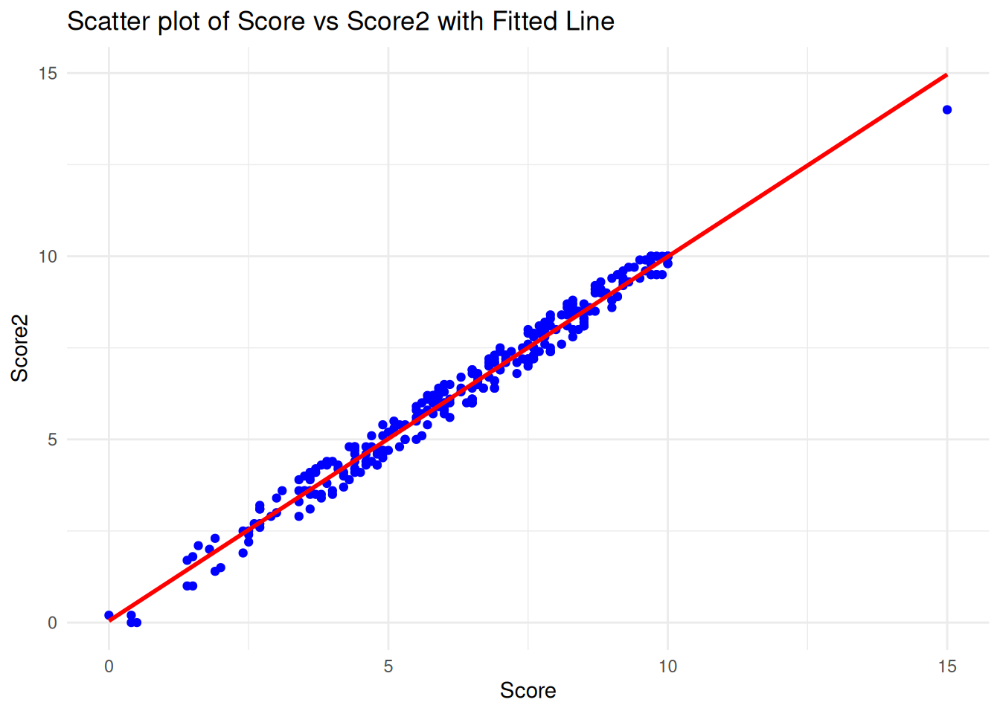](index_files/figure-html/unnamed-chunk-20-1.png)

## Python 🐍

``` python
# Drop rows with missing values in score or score2
child_data_clean = child_data[['score', 'score2']].dropna()

# Create a scatter plot with a fitted line (regression line)
plt.figure(figsize=(8, 6))
sns.regplot(x='score', y='score2', data=child_data_clean, line_kws={"color": "red"}, ci=None)
plt.title('Scatter plot of Score vs Score2 with Fitted Line')
plt.xlabel('Score')
plt.ylabel('Score2')
plt.grid(True)
```

[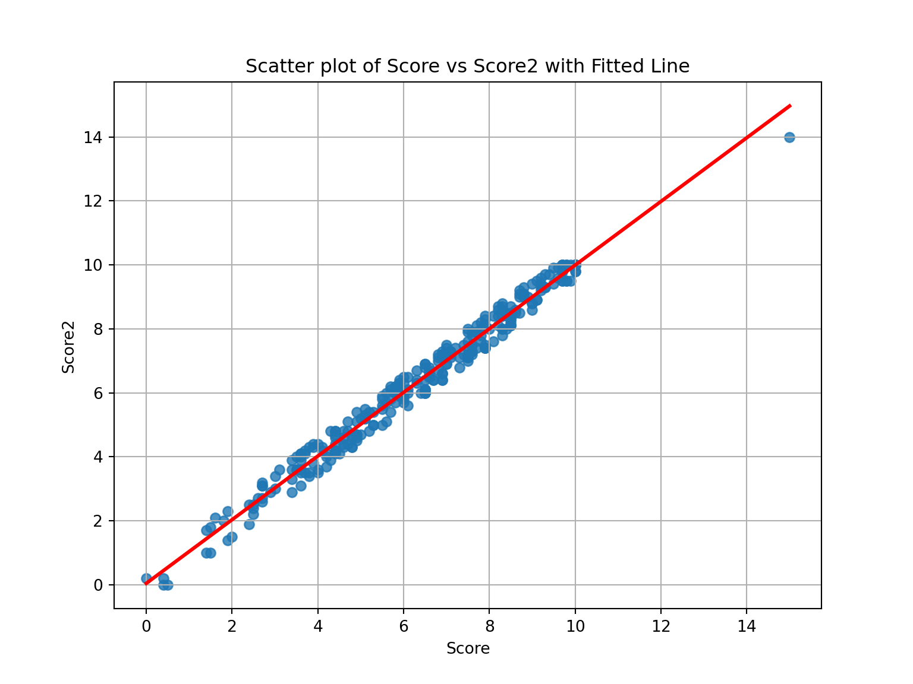](index_files/figure-html/unnamed-chunk-21-1.png)

**Interpretation of the Scatter Plot with Fitted Line**:

The scatter plot shows the relationship between `score` (x-axis) and `score2` (y-axis), with a red fitted regression line. The data points appear to be closely aligned with the regression line, suggesting a strong linear relationship between the two variables. As the standard score (`score`) increases, the alternative score (`score2`) also increases in a nearly proportional manner.

The fitted line demonstrates that for different values of `score`, the corresponding value of `score2` can be predicted with a high degree of accuracy. This strong correlation suggests that a linear regression model would be a good fit for predicting `score2` from `score`.

Next, we can proceed with predicting `score2` for a child with a standard score of 7 and 12 using the linear model.

## R Ⓡ

``` r
# Fit a linear regression model
model <- lm(score2 ~ score, data = clean_data)

# Predict score2 for a child with a score of 7 and 12

predicted_score2_for_7 <- predict(model, data.frame(score = 7))

predicted_score2_for_12 <- predict(model, data.frame(score = 12))

# Output the predictions
cat("Predicted score2 for a child with a score of 7: ", predicted_score2_for_7, "\n")
```

    #> Predicted score2 for a child with a score of 7:  7.007971

``` r
cat("Predicted score2 for a child with a score of 12: ", predicted_score2_for_12, "\n")
```

    #> Predicted score2 for a child with a score of 12:  11.98049

## Python 🐍

``` python
# Define the predictor (X) and target (y)
X = child_data_clean[['score']]  # Independent variable (score)
y = child_data_clean['score2']    # Dependent variable (score2)

# Fit a linear regression model
model = LinearRegression()
model.fit(X, y)
```

    LinearRegression()

**In a Jupyter environment, please rerun this cell to show the HTML representation or trust the notebook.  
On GitHub, the HTML representation is unable to render, please try loading this page with nbviewer.org.**

LinearRegression

[?Documentation for LinearRegression](https://scikit-learn.org/1.7/modules/generated/sklearn.linear_model.LinearRegression.html)iFitted

Parameters

|     |                |       |
|-----|----------------|-------|
|     | fit_intercept  | True  |
|     | copy_X         | True  |
|     | tol            | 1e-06 |
|     | n_jobs         | None  |
|     | positive       | False |

``` python
# Predict score2 for a child with a standard score of 7 and 12
predicted_score2_for_7 = model.predict([[7]])

predicted_score2_for_12 = model.predict([[12]])

# Output the predictions
print(f"Predicted score2 for a child with a score of 7: {predicted_score2_for_7[0]:.2f}")
```

    #> Predicted score2 for a child with a score of 7: 7.01

``` python
print(f"Predicted score2 for a child with a score of 12: {predicted_score2_for_12[0]:.2f}")
```

    #> Predicted score2 for a child with a score of 12: 11.98

Based on the linear regression model:

- For a child with a standard score of 7, the predicted alternative score (score2) is 7.01.

- For a child with a standard score of 12, the predicted alternative score (score2) is 11.98.

These results suggest a strong linear relationship between score and score2, with both scores closely aligned.

# Question 4

Create a dataset containing all the data in `child.csv` plus a new column `ageGroup` with values “Five and under” and “6 and over.” Compare the standard score against the cost for each age group, and show whether there was a family history of autism. Comment on your visualizations.

## Solution

## R Ⓡ

``` r
clean_data <- clean_data %>%
  mutate(ageGroup = case_when(age >= 6 ~ "6 and over", TRUE ~ "Five and under"))

clean_data %>%
  ggplot(aes(x = cost, y = score, color = ageGroup)) +
  geom_line() +
  facet_grid(ageGroup ~ autismFH, scales = "free") +
  labs(title = "Cost vs. Score by Age Group and Family History of Autism")
```

[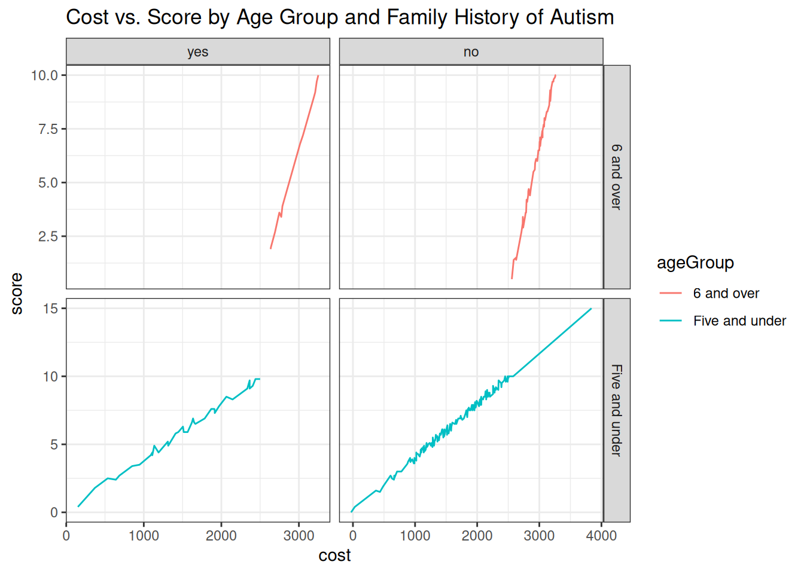](index_files/figure-html/unnamed-chunk-24-1.png)

## Python 🐍

``` python
def create_plot():
    # Create the 'ageGroup' column based on the 'age' column
    clean_data['ageGroup'] = clean_data['age'].apply(lambda x: 'Five and under' if x <= 5 else '6 and over')

    # Set up the FacetGrid
    g = sns.FacetGrid(clean_data, row='ageGroup', col='autismFH', margin_titles=True, height=4, aspect=1.5)
    g.map(sns.lineplot, 'cost', 'score', color='b')

    # Add labels and titles
    g.fig.suptitle("Cost vs. Score by Age Group and Family History of Autism", y=1.03)
    g.set_axis_labels("Cost", "Score")

    return g

# Call the function
g = create_plot()
plt.show()
```

[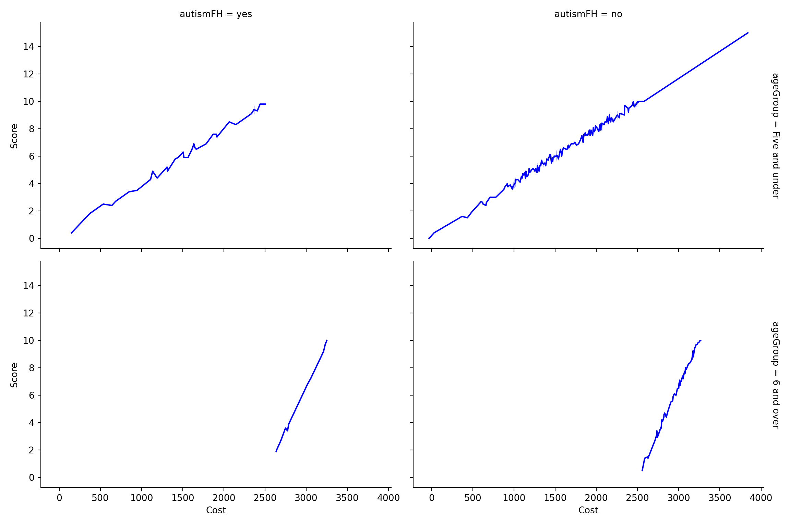](index_files/figure-html/unnamed-chunk-25-1.png)

**Interpretation:**

Children aged five years and under with a family history of autism tend to have lower costs associated with standard autism testing.

# Question 5

Discuss the following statement using a maximum of three plot examples to illustrate your explanations (Word limit: 300 words):

There are different methods of displaying data, with no single method being suitable for all data types. Some visualizations effectively convey the intended information, while others fail. The data-ink ratio and lie factor also contribute to the quality of a visualization.

**Note**: Your plot examples must relate to the `child.csv` dataset.

## Solution: Part 1

``` r
p1 <- clean_data %>%
  ggplot(aes(x = score)) +
  geom_histogram(binwidth = 5, fill = "dark blue") +
  labs(title = "Histogram")

p2 <- clean_data %>%
  ggplot(aes(y = score)) +
  geom_boxplot(fill = "dark blue") +
  theme(axis.text.x = element_blank(), axis.ticks.x = element_blank()) +
  labs(title = "Boxplot")

p3 <- clean_data %>%
  ggplot(aes(x = score)) +
  geom_dotplot(binwidth = 0.23, stackratio = 1, fill = "blue", stroke = 2) +
  scale_y_continuous(NULL, breaks = NULL) +
  labs(title = "Dot Plot")

p1 / (p2 + p3) + plot_annotation(title = "Different Plots for Standard Test Scores")
```

[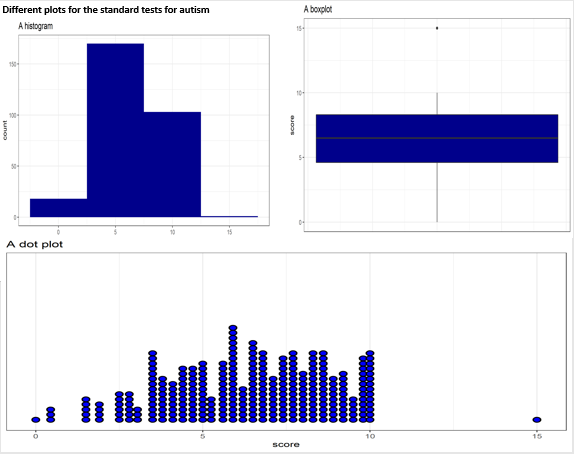](Q5a.png)

Histograms and boxplots are common for showing the distribution of continuous variables. Dot plots, though suitable for smaller datasets, can become cluttered with more data. When dealing with large datasets, boxplots or histograms are more effective.

## Solution: Part 2

``` r
#|
p1 <- clean_data %>%
  count(relation) %>%
  ggplot(aes(x = reorder(relation, n), y = n, fill = relation)) +
  geom_col(width = 0.4, show.legend = FALSE) +
  labs(title = "Bar Chart", x = "")

p2 <- clean_data %>%
  select(relation) %>%
  count(relation) %>%
  ggplot(aes(x = reorder(relation, n), y = n)) +
  geom_segment(aes(xend = relation, yend = 0)) +
  geom_point(size = 6, color = "orange") +
  theme_bw() +
  xlab("")

p3 <- clean_data %>%
  select(relation) %>%
  count(relation) %>%
  treemap(index = "relation", vSize = "n", title = "Treemap")

p4 <- pie(
  table(clean_data$relation),
  col = c("purple", "violetred1", "green3", "cornsilk"),
  radius = 0.9,
  main = "Pie Chart"
)
```

[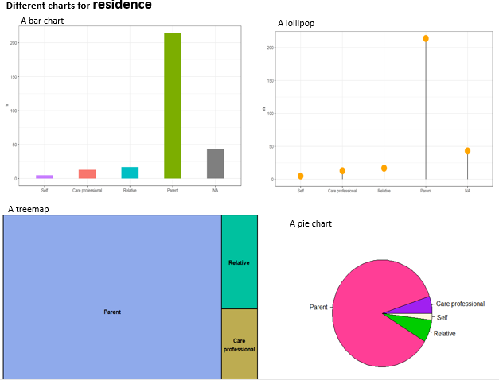](Q5b.png)

Pie charts can be less effective when dealing with multiple categories, as they require interpreting angles and comparing non-adjacent slices. Bar charts or treemaps may be more effective in such cases.

# Question 6

Assume you have an additional 19 independent datasets with the same number of observations about children tested for autism. Load the `independent_data.csv` dataset, which includes the distribution for the attribute `autism`, and demonstrate that the size of the confidence intervals for the average percentage of positive cases of autism increases as the confidence level increases (90%, 95%, 98%). Discuss any improvements that could enhance your demonstration.

## Solution

## R Ⓡ

``` r
another_dataset <- read_csv("independent_dataset.csv")

# Function to calculate the size of confidence intervals
conf.size <- function(dataset, level = 0.90) {
  t_test <- t.test(dataset[, 2] %>% pull(), conf.level = level)
  print(t_test$conf.int)
}

conf.size(another_dataset, level = 0.9)
```

    #> [1] 48.41712 50.42498
    #> attr(,"conf.level")
    #> [1] 0.9

``` r
conf.size(another_dataset, level = 0.95)
```

    #> [1] 48.20473 50.63738
    #> attr(,"conf.level")
    #> [1] 0.95

``` r
conf.size(another_dataset, level = 0.98)
```

    #> [1] 47.94336 50.89875
    #> attr(,"conf.level")
    #> [1] 0.98

## Python 🐍

``` python
# Load the dataset
independent_data = pd.read_csv('independent_dataset.csv')

# Extract the percentages of positive autism cases
percentages = independent_data['Percentage of autism = YES']

# Calculate the mean and standard error of the percentages
mean_percentage = np.mean(percentages)
std_error = stats.sem(percentages)

# Confidence levels and corresponding z-scores
confidence_levels = [0.90, 0.95, 0.98]
z_scores = [stats.norm.ppf((1 + cl) / 2) for cl in confidence_levels]

# Calculate the confidence intervals
conf_intervals = [(mean_percentage - z * std_error, mean_percentage + z * std_error) for z in z_scores]

# Plotting the confidence intervals
plt.figure(figsize=(8, 6))
for i, (low, high) in enumerate(conf_intervals):
    plt.plot([confidence_levels[i]*100, confidence_levels[i]*100], [low, high], marker='o', label=f'{confidence_levels[i]*100}% CI')

plt.axhline(y=mean_percentage, color='r', linestyle='--', label=f'Mean = {mean_percentage:.2f}%')
plt.title('Confidence Intervals for Percentage of Positive Autism Cases')
plt.xlabel('Confidence Level (%)')
plt.ylabel('Percentage of Autism = YES')
plt.legend()
plt.grid(True)
plt.show()
```

[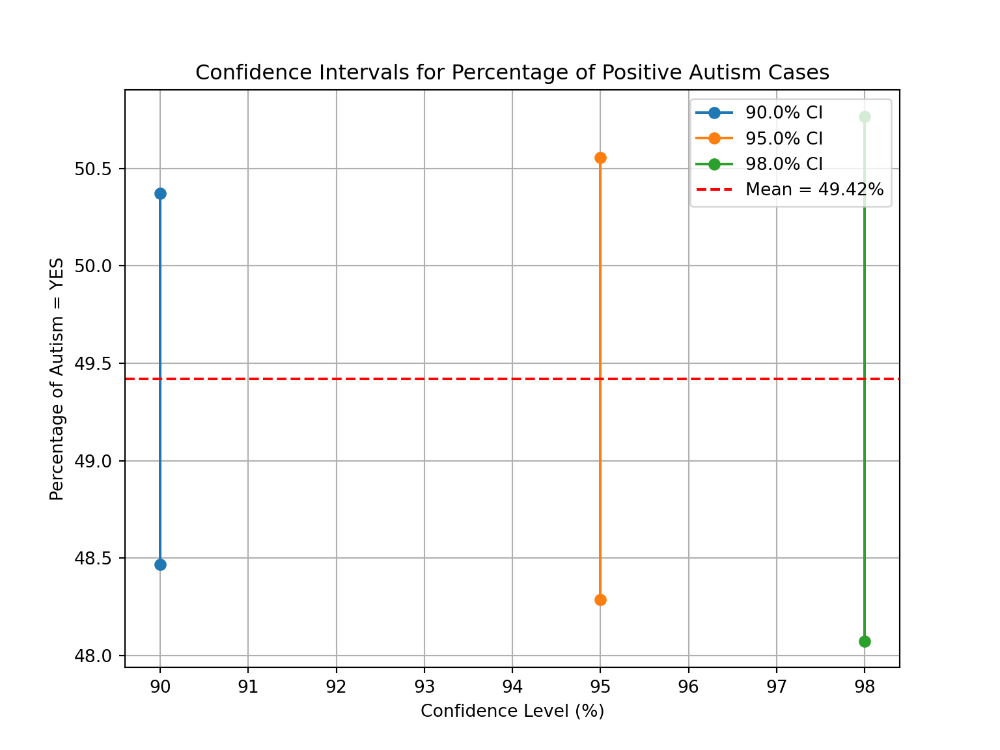](index_files/figure-html/unnamed-chunk-29-1.png)

**Interpretation**:

- The 90% confidence interval for the average percentage of positive cases of autism ranges from 48.42% to 50.42%.

- The 95% confidence interval for the average percentage of positive cases of autism ranges from 48.20% to 50.64%.

- The 98% confidence interval for the average percentage of positive cases of autism ranges from 47.94% to 50.90%.

> **Overall Interpretation**

As the confidence level increases, the confidence intervals become wider, making it harder to reject the null hypothesis.

------------------------------------------------------------------------

[](https://media2.giphy.com/media/LXiElF2dzvUmQ/giphy.gif "Congratulations!")

Congratulations!

Back to top
