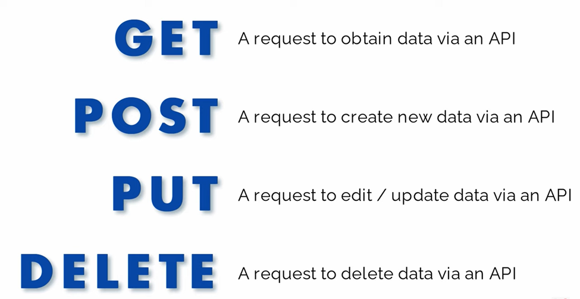

## What is an API?

[](API.jpg "Image source: Unsplash")

Image source: Unsplash

An API (Application Programming Interface) is a set of protocols, routines, and tools used for building software applications. It is essentially a set of rules and methods that data analyst or software developers can use to interact with and access the services and features provided by another application, service or platform.

In simpler terms, an API allows different software applications to communicate with each other and share data in a standardized way. With APIs, developers or analysts can get data without needing to scrape the website, manually download it, or directly go to the company from which they need it.

[](how-api-work.jpg "Figure 1: How API work")

Figure 1: How API work

For example, if you want to integrate a weather forecast feature into your app, you can use a weather API that provides the necessary data, rather than building the entire feature from scratch. This allows you to focus on the unique aspects of your app, without worrying about the underlying functionality.

## Type of request methods

[](image-849919650.png "Figure 2: Types of request method")

Figure 2: Types of request method

As shown in [Figure 2](#fig-api-method), the most common type of API request method is `GET`.

## General rules for using an API

To use an API to extract data, you will need to follow these steps:

1.  Find an API that provides the data you are interested in. This may involve doing some research online to find available APIs.

2.  Familiarize yourself with the API’s documentation to understand how to make requests and what data is available.

3.  Use a programming language to write a script that sends a request to the API and receives the data. Depending on the API, you may need to include authentication parameters in the request to specify the data you want to receive.

4.  Parse the data you receive from the API to extract the information you are interested in. The format of the data will depend on the API you are using, and may be in JSON, XML, or another format.

5.  Process the extracted data in your script, or save it to a file or database for later analysis.

## How to fetch API data using a programming language

### with R Ⓡ

There are several packages available in R for consuming APIs. Some of the most commonly used packages are:

1.  **httr**: This package provides convenient functions for making HTTP requests and processing the responses.

2.  **jsonlite**: This package is used for parsing JSON data, which is a common format for API responses.

3.  **RCurl**: This package is a wrapper around the libcurl library, which is a powerful and versatile HTTP client library.

To get data from an API in R, you need to follow these steps:

1.  Install the required packages by running the following command in the R console:

``` r
install.packages(c("httr", "jsonlite", "RCurl"))
```

2.  Load the packages by running the following command:

``` r
library(httr)

library(jsonlite)

library(RCurl)
```

3.  Make an API request by using the GET function from the httr package. The API endpoint should be passed as an argument to this function.

``` r
response <- GET("https://api.example.com/endpoint")
```

4.  Check the status code of the response to see if the request was successful. A status code of `200` indicates a successful request.

``` r
status_code <- status_code(response)
```

5.  Extract the data from the response. If the API returns data in JSON format, you can use the `fromJSON` function from the `jsonlite` package to parse the data. Store the data in a variable for later use.

``` r
api_data <- fromJSON(content(response, as = "text"))
```

These are the basic steps to get data from an API in R. Depending on the API, you may need to pass additional parameters or authentication information in your request. For example,

``` r
response <- GET(
  "https://api.example.com/endpoint",
  authenticate(
    user = "API_KEY_HERE",
    password = "API_PASSWORD_HERE",
    type = "basic"
  )
)
```

### with Python 🐍

To use an API in Python, you can use a library such as `requests` or `urllib` to send HTTP requests to the API and receive responses. Here’s an example of how to use an API in Python using the requests library:

``` python
import requests

# Define the API endpoint URL and parameters
endpoint = 'https://api.example.com/data'

params = {'param1': 'value1', 'param2': 'value2'}

# Send a GET request to the API endpoint
response = requests.get(endpoint, params = params)

# Check if the request was successful
if response.status_code == 200:
    # Parse the response JSON data
    data = response.json()

    # Process the data, for example by printing it to the console
    print(data)
else:
    print(f'Error: {response.status_code}')
```

In this example, we’re using the `requests` library to send a GET request to an API endpoint at `https://api.example.com/data`, passing two parameters (`param1` and `param2`) in the request. The `requests.get()` method returns a `Response` object, which we can use to check the response status code and parse the response data.

If the status code is `200`, we can assume the request was successful, and we can parse the response data using the `response.json()` method, which converts the JSON-formatted response to a Python object. We can then process the data as needed, for example by printing it to the console.

Of course, the exact API endpoint and parameters will depend on the specific API that you are using, and you’ll need to consult the API documentation to learn how to construct your request correctly. But this example should give you a sense of the general process involved in using an API in Python.

## Practical Examples in R and Python

We will use R and Python to fetch the API data with and without the key.

### Without the key

In this example, we will use an API from a site called [](https://www.givefood.org.uk/api/2/docs/) that uses an API without an API key. In this case, we will be using a `GET` request to fetch the API data at the **food banks** using this link: [https://www.givefood.org.uk/api/2/foodbanks](https://www.givefood.org.uk/api/2/foodbanks). Please follow the steps in [Section 4.1](#sec-api-r) for R and [Section 4.2](#sec-api-py) for Python.

## R Ⓡ

``` r
library(httr)

library(jsonlite)

library(dplyr)

response <- GET("https://www.givefood.org.uk/api/2/foodbanks")
```

    #> Error in curl::curl_fetch_memory(url, handle = handle): Timeout was reached: [www.givefood.org.uk] SSL/TLS connection timeout

``` r
status_code(response)
```

    #> Error: object 'response' not found

``` r
food_dataframe <- fromJSON(content(response, as = "text"), flatten = TRUE)
```

    #> Error: object 'response' not found

``` r
food_dataframe %>%
  dim()
```

    #> Error: object 'food_dataframe' not found

``` r
food_dataframe %>%
  head()
```

    #> Error: object 'food_dataframe' not found

## Python 🐍

``` python
import requests

import pandas as pd

response = requests.get("https://www.givefood.org.uk/api/2/foodbanks")

# Check if the request was successful

print(response.status_code)
```

    #> 200

``` python
# Parse the response JSON data

food_json = response.json()

# Convert to a pandas dataframe

food_dataframe = pd.json_normalize(food_json)

food_dataframe.shape
```

    #> (955, 27)

``` python
food_dataframe.head()
```

    #>                                       name  ...                                 politics.urls.html
    #> 0  Thorne and Moorends Community Food Bank  ...  https://www.givefood.org.uk/needs/in/constitue...
    #> 1                       Chiltern Food Bank  ...  https://www.givefood.org.uk/needs/in/constitue...
    #> 2                          Poole Food Bank  ...  https://www.givefood.org.uk/needs/in/constitue...
    #> 3       Littlehampton & District Food Bank  ...  https://www.givefood.org.uk/needs/in/constitue...
    #> 4               Food For Thought Food Bank  ...  https://www.givefood.org.uk/needs/in/constitue...
    #> 
    #> [5 rows x 27 columns]

In this example, we use the `pd.json_normalize()` method to flatten the list of dictionaries and create a dataframe from it. The resulting dataframe has columns for each key in the JSON objects.

### With the key

In this example, we will use an API from [](https://www.reed.co.uk/developers/Jobseeker) that uses an API key. In this case, we will use a `GET` request to fetch data for analyst jobs based in London from the [Jobseeker](https://www.reed.co.uk/api/1.0/search?keywords=analyst&location=london&distancefromlocation=15) API. Please follow the steps in [Section 4.1](#sec-api-r) for R and [Section 4.2](#sec-api-py) for Python, and sign up for the API key at the Jobseeker [website](https://www.reed.co.uk/developers/Jobseeker).

## R Ⓡ

``` r
library(httr)

library(jsonlite)

library(dplyr)

# Create a GET response to call the API

response <- GET(
  "https://www.reed.co.uk/api/1.0/search?keywords=analyst&location=london&distancefromlocation=15",
  authenticate(
    user = Sys.getenv("putyourapikeyhere"),
    password = ""
  )
)
```

> **TIP:**
>
> Replace `Sys.getenv("putyourapikeyhere")` with your own API key.

``` r
status_code(response)
```

    #> [1] 200

``` r
# Convert the JSON string to a dataframe and view data in a table

job_dataframe <- fromJSON(content(response, as = "text"), flatten = TRUE)

# The job dataframe is inside the results

job_dataframe$results %>%
  dim()
```

    #> [1] 100  15

``` r
job_dataframe$results %>%
  head()
```

## Python 🐍

``` python
import requests

import pandas as pd

# Set API endpoint and API key

url = "https://www.reed.co.uk/api/1.0/search?keywords=analyst&location=london&distancefromlocation=15"

api_key = "replace with your own API key" 
```

Based on the instructions in the API documentation, you will need to include your API key for all requests in a basic authentication http header as the username, leaving the password empty.

``` python
# Send a GET request to the API endpoint

response = requests.get(url, auth = (api_key, ''))
```

``` python
# Check if the request was successful

print(response.status_code)
```

    #> 200

``` python
# Parse the response JSON data

job_json = response.json()

# Convert to a pandas dataframe

# The dataframe is inside the results

job_dataframe = pd.json_normalize(job_json["results"])

job_dataframe.shape
```

    #> (100, 15)

``` python
job_dataframe.head()
```

    #>       jobId  ...                                             jobUrl
    #> 0  54673700  ...  https://www.reed.co.uk/jobs/contract-analyst/5...
    #> 1  53358077  ...   https://www.reed.co.uk/jobs/soc-analyst/53358077
    #> 2  54067435  ...   https://www.reed.co.uk/jobs/soc-analyst/54067435
    #> 3  54571153  ...  https://www.reed.co.uk/jobs/reward-analyst/545...
    #> 4  54648789  ...  https://www.reed.co.uk/jobs/fraud-analyst/5464...
    #> 
    #> [5 rows x 15 columns]

You can now use the data for your data science.

## Other resources

You can also watch `Dean Chereden` YouTube video on how to GET data from an API using R in RStudio.

# An error occurred.

Unable to execute JavaScript.

------------------------------------------------------------------------

I hope you found this article informative. You can find its GitHub repository [here](https://github.com/gbganalyst/API-in-R-and-Python). If you enjoyed reading this write-up, please follow me on [Twitter](https://twitter.com/gbganalyst) and [Linkedin](https://linkedin.com/in/ezekiel-ogundepo) for more updates on `R`, `Python`, and `Excel` for data science.

Back to top
