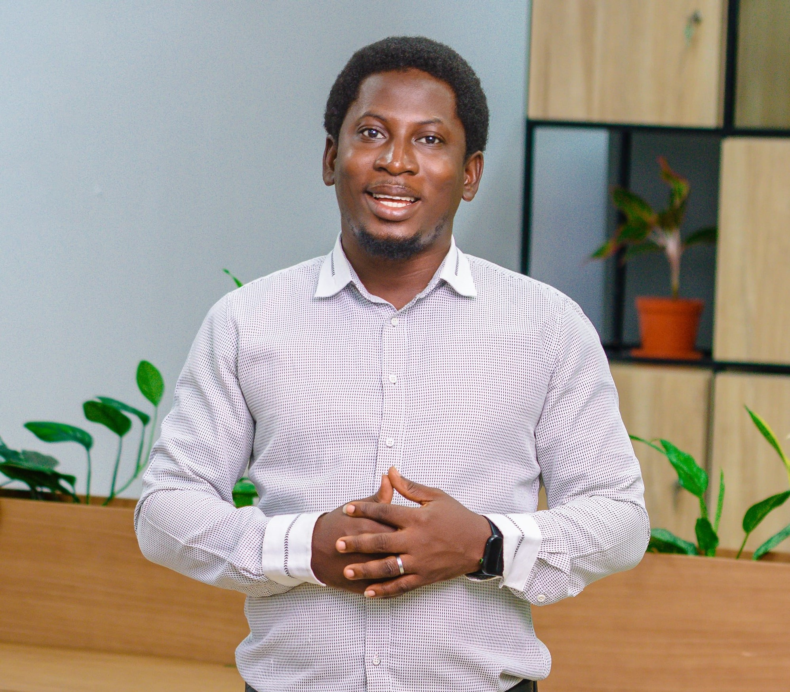
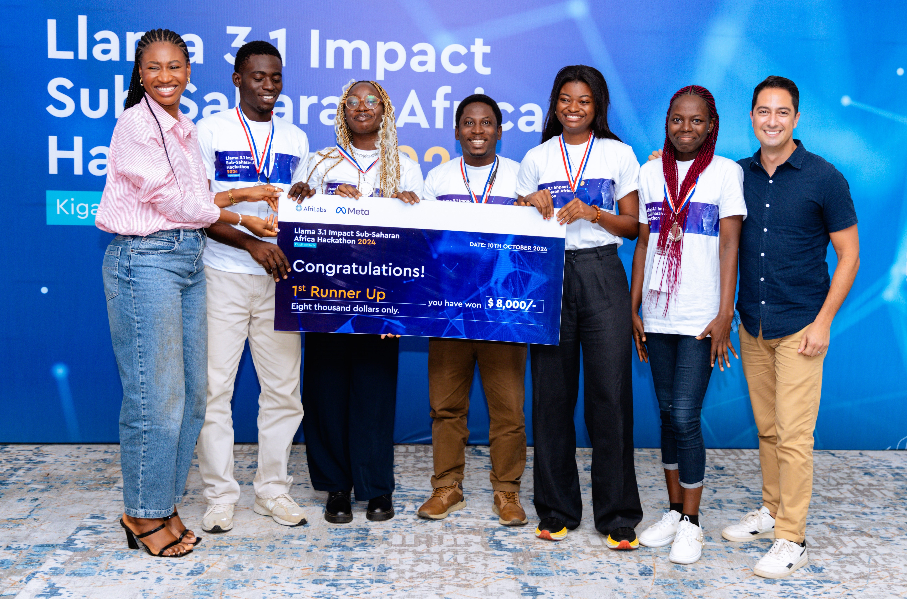
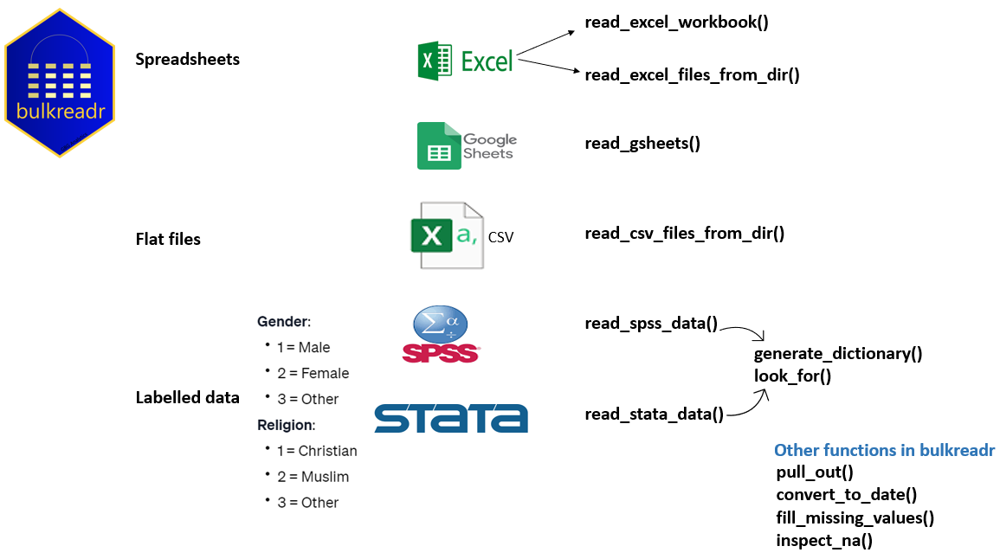
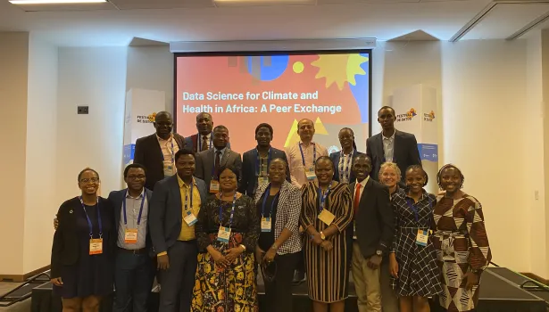

# Hi, I'm Ezekiel.

I am a data science professional with over ten years of experience in statistical modelling, data analysis, and advanced analytics. I graduated with first-class honours in Statistics from the University of Ilorin, Nigeria, and hold a Master’s degree in Mathematical Sciences from the African Institute for Mathematical Sciences (AIMS), Rwanda, supported by a Mastercard scholarship.

I am honoured to be a Mastercard Scholar, Federal Government of Nigeria (FSB) Scholar, UNLEASH Talent, Heidelberg Laureate Forum (HLF) Fellow, and Capacity Accelerator Network (CAN) Fellow of the Global Partnership for Sustainable Development Data.

My professional journey includes pivotal roles at the Rwanda Revenue Authority (RRA) as a Consultant Data Scientist, where I contributed to developing a dynamic taxpayers’ data portal, and at Data Science Nigeria (DSN), where I led data analytics projects, trained companies in data analytics, and organized major AI hackathons. As a former Senior Data Analytics Manager at 54gene, I implemented advanced data management and quality control procedures. As a [CAN Fellow](https://www.data4sdgs.org/blog/data-science-health-and-climate-africa-meet-can-fellows) at eHealth Africa, I enhanced public health surveillance for cholera outbreaks in Yobe State, Nigeria, utilizing geospatial machine learning and data-driven approaches.

I am a passionate contributor to the data science community, having developed the [bulkreadr](https://gbganalyst.github.io/bulkreadr) and [forstringr ](https://gbganalyst.github.io/forstringr/) CRAN R programming packages and contributed to the [Big Book of R](https://www.bigbookofr.com/) and the 'ralger' package. I co-edited the "Beginners’ Artificial Intelligence & Python Programming Book" and helped create the Nigeria COVID-19 data repository for researchers. Moreover, I am part of the organizing team for [IndabaX Nigeria](https://indabaxng.github.io/), one of the largest AI conferences in the country.

As an active member of the Africa R programming community and a certified RStudio Tidyverse instructor, I have published numerous research papers and provided consultancy to clients globally. I excel in data wrangling, analysis, tool-building, and process automation, with a strong commitment to utilizing data-driven solutions to address real-world challenges and promote sustainable development.

![](data:image/svg+xml;base64,PHN2ZyB4bWxucz0iaHR0cDovL3d3dy53My5vcmcvMjAwMC9zdmciIHZlcnNpb249IjEuMSIgeGxpbms9Imh0dHA6Ly93d3cudzMub3JnLzE5OTkveGxpbmsiIHhtbG5zOnN2Z2pzPSJodHRwOi8vc3ZnanMuZGV2L3N2Z2pzIiB2aWV3Ym94PSIwIDAgODAwIDE1MCIgb3BhY2l0eT0iMSI+PGRlZnM+PGxpbmVhcmdyYWRpZW50IGdyYWRpZW50dHJhbnNmb3JtPSJyb3RhdGUoMjcwKSIgeDE9IjUwJSIgeTE9IjAlIiB4Mj0iNTAlIiB5Mj0iMTAwJSIgaWQ9InNzc3F1aWdnbHktZ3JhZCI+PHN0b3Agc3RvcC1jb2xvcj0iaHNsKDQ0LCA5NyUsIDQ2JSkiIHN0b3Atb3BhY2l0eT0iMSIgb2Zmc2V0PSIwJSI+PC9zdG9wPjxzdG9wIHN0b3AtY29sb3I9ImhzbCg0NCwgOTclLCA0NiUpIiBzdG9wLW9wYWNpdHk9IjEiIG9mZnNldD0iMTAwJSI+PC9zdG9wPjwvbGluZWFyZ3JhZGllbnQ+PC9kZWZzPjxnIHN0cm9rZS13aWR0aD0iMS41IiBzdHJva2U9InVybCgjc3NzcXVpZ2dseS1ncmFkKSIgZmlsbD0ibm9uZSIgc3Ryb2tlLWxpbmVjYXA9InJvdW5kIiB0cmFuc2Zvcm09Im1hdHJpeCgxLDAsMCwxLC01LDUxLjAwNzQ4MDYyMTMzNzg5KSI+CjxwYXRoIGQ9Ik0xMCwxMEMzMS43MjYxOTA0NzYxOTA0NzgsMTEuNjY2NjY2NjY2NjY2NjY2LDY4Ljc1LDI0LjY2NjY2NjY2NjY2NjY2NCwxMTQuMjg1NzE0Mjg1NzE0MjksMThDMTU5LjgyMTQyODU3MTQyODU4LDExLjMzMzMzMzMzMzMzMzMzNCwxODAuOTUyMzgwOTUyMzgwOTYsLTIyLjgzMzMzMzMzMzMzMzMzMiwyMjguNTcxNDI4NTcxNDI4NTgsLTIyQzI3Ni4xOTA0NzYxOTA0NzYyLC0yMS4xNjY2NjY2NjY2NjY2NjgsMjk1LjIzODA5NTIzODA5NTMsMTkuOTE2NjY2NjY2NjY2NjY4LDM0Mi44NTcxNDI4NTcxNDI5LDIyQzM5MC40NzYxOTA0NzYxOTA1LDI0LjA4MzMzMzMzMzMzMzMzMiw0MDkuNTIzODA5NTIzODA5NSwtMTQuOTE2NjY2NjY2NjY2NjY4LDQ1Ny4xNDI4NTcxNDI4NTcxNywtMTJDNTA0Ljc2MTkwNDc2MTkwNDgsLTkuMDgzMzMzMzMzMzMzMzMyLDUyMy44MDk1MjM4MDk1MjM5LDMzLjcwODMzMzMzMzMzMzMzNiw1NzEuNDI4NTcxNDI4NTcxNCwzNkM2MTkuMDQ3NjE5MDQ3NjE5LDM4LjI5MTY2NjY2NjY2NjY2NCw2MzguMDk1MjM4MDk1MjM4MiwtMS44MzMzMzMzMzMzMzMzMzMzLDY4NS43MTQyODU3MTQyODU4LC0xQzczMy4zMzMzMzMzMzMzMzM0LC0wLjE2NjY2NjY2NjY2NjY2Njc0LDc3Ni4xOTA0NzYxOTA0NzYxLDMxLjQ1ODMzMzMzMzMzMzMzNiw4MDAsNDAiIHRyYW5zZm9ybT0ibWF0cml4KDEsMCwwLDEsMCw1MCkiIC8+PHBhdGggZD0iTTEwLDEwQzMxLjcyNjE5MDQ3NjE5MDQ3OCwxMS42NjY2NjY2NjY2NjY2NjYsNjguNzUsMjQuNjY2NjY2NjY2NjY2NjY0LDExNC4yODU3MTQyODU3MTQyOSwxOEMxNTkuODIxNDI4NTcxNDI4NTgsMTEuMzMzMzMzMzMzMzMzMzM0LDE4MC45NTIzODA5NTIzODA5NiwtMjIuODMzMzMzMzMzMzMzMzMyLDIyOC41NzE0Mjg1NzE0Mjg1OCwtMjJDMjc2LjE5MDQ3NjE5MDQ3NjIsLTIxLjE2NjY2NjY2NjY2NjY2OCwyOTUuMjM4MDk1MjM4MDk1MywxOS45MTY2NjY2NjY2NjY2NjgsMzQyLjg1NzE0Mjg1NzE0MjksMjJDMzkwLjQ3NjE5MDQ3NjE5MDUsMjQuMDgzMzMzMzMzMzMzMzMyLDQwOS41MjM4MDk1MjM4MDk1LC0xNC45MTY2NjY2NjY2NjY2NjgsNDU3LjE0Mjg1NzE0Mjg1NzE3LC0xMkM1MDQuNzYxOTA0NzYxOTA0OCwtOS4wODMzMzMzMzMzMzMzMzIsNTIzLjgwOTUyMzgwOTUyMzksMzMuNzA4MzMzMzMzMzMzMzM2LDU3MS40Mjg1NzE0Mjg1NzE0LDM2QzYxOS4wNDc2MTkwNDc2MTksMzguMjkxNjY2NjY2NjY2NjY0LDYzOC4wOTUyMzgwOTUyMzgyLC0xLjgzMzMzMzMzMzMzMzMzMzMsNjg1LjcxNDI4NTcxNDI4NTgsLTFDNzMzLjMzMzMzMzMzMzMzMzQsLTAuMTY2NjY2NjY2NjY2NjY2NzQsNzc2LjE5MDQ3NjE5MDQ3NjEsMzEuNDU4MzMzMzMzMzMzMzM2LDgwMCw0MCIgdHJhbnNmb3JtPSJtYXRyaXgoMSwwLDAsMSwwLDQwKSIgLz48cGF0aCBkPSJNMTAsMTBDMzEuNzI2MTkwNDc2MTkwNDc4LDExLjY2NjY2NjY2NjY2NjY2Niw2OC43NSwyNC42NjY2NjY2NjY2NjY2NjQsMTE0LjI4NTcxNDI4NTcxNDI5LDE4QzE1OS44MjE0Mjg1NzE0Mjg1OCwxMS4zMzMzMzMzMzMzMzMzMzQsMTgwLjk1MjM4MDk1MjM4MDk2LC0yMi44MzMzMzMzMzMzMzMzMzIsMjI4LjU3MTQyODU3MTQyODU4LC0yMkMyNzYuMTkwNDc2MTkwNDc2MiwtMjEuMTY2NjY2NjY2NjY2NjY4LDI5NS4yMzgwOTUyMzgwOTUzLDE5LjkxNjY2NjY2NjY2NjY2OCwzNDIuODU3MTQyODU3MTQyOSwyMkMzOTAuNDc2MTkwNDc2MTkwNSwyNC4wODMzMzMzMzMzMzMzMzIsNDA5LjUyMzgwOTUyMzgwOTUsLTE0LjkxNjY2NjY2NjY2NjY2OCw0NTcuMTQyODU3MTQyODU3MTcsLTEyQzUwNC43NjE5MDQ3NjE5MDQ4LC05LjA4MzMzMzMzMzMzMzMzMiw1MjMuODA5NTIzODA5NTIzOSwzMy43MDgzMzMzMzMzMzMzMzYsNTcxLjQyODU3MTQyODU3MTQsMzZDNjE5LjA0NzYxOTA0NzYxOSwzOC4yOTE2NjY2NjY2NjY2NjQsNjM4LjA5NTIzODA5NTIzODIsLTEuODMzMzMzMzMzMzMzMzMzMyw2ODUuNzE0Mjg1NzE0Mjg1OCwtMUM3MzMuMzMzMzMzMzMzMzMzNCwtMC4xNjY2NjY2NjY2NjY2NjY3NCw3NzYuMTkwNDc2MTkwNDc2MSwzMS40NTgzMzMzMzMzMzMzMzYsODAwLDQwIiB0cmFuc2Zvcm09Im1hdHJpeCgxLDAsMCwxLDAsMzApIiAvPjxwYXRoIGQ9Ik0xMCwxMEMzMS43MjYxOTA0NzYxOTA0NzgsMTEuNjY2NjY2NjY2NjY2NjY2LDY4Ljc1LDI0LjY2NjY2NjY2NjY2NjY2NCwxMTQuMjg1NzE0Mjg1NzE0MjksMThDMTU5LjgyMTQyODU3MTQyODU4LDExLjMzMzMzMzMzMzMzMzMzNCwxODAuOTUyMzgwOTUyMzgwOTYsLTIyLjgzMzMzMzMzMzMzMzMzMiwyMjguNTcxNDI4NTcxNDI4NTgsLTIyQzI3Ni4xOTA0NzYxOTA0NzYyLC0yMS4xNjY2NjY2NjY2NjY2NjgsMjk1LjIzODA5NTIzODA5NTMsMTkuOTE2NjY2NjY2NjY2NjY4LDM0Mi44NTcxNDI4NTcxNDI5LDIyQzM5MC40NzYxOTA0NzYxOTA1LDI0LjA4MzMzMzMzMzMzMzMzMiw0MDkuNTIzODA5NTIzODA5NSwtMTQuOTE2NjY2NjY2NjY2NjY4LDQ1Ny4xNDI4NTcxNDI4NTcxNywtMTJDNTA0Ljc2MTkwNDc2MTkwNDgsLTkuMDgzMzMzMzMzMzMzMzMyLDUyMy44MDk1MjM4MDk1MjM5LDMzLjcwODMzMzMzMzMzMzMzNiw1NzEuNDI4NTcxNDI4NTcxNCwzNkM2MTkuMDQ3NjE5MDQ3NjE5LDM4LjI5MTY2NjY2NjY2NjY2NCw2MzguMDk1MjM4MDk1MjM4MiwtMS44MzMzMzMzMzMzMzMzMzMzLDY4NS43MTQyODU3MTQyODU4LC0xQzczMy4zMzMzMzMzMzMzMzM0LC0wLjE2NjY2NjY2NjY2NjY2Njc0LDc3Ni4xOTA0NzYxOTA0NzYxLDMxLjQ1ODMzMzMzMzMzMzMzNiw4MDAsNDAiIHRyYW5zZm9ybT0ibWF0cml4KDEsMCwwLDEsMCwyMCkiIC8+PHBhdGggZD0iTTEwLDEwQzMxLjcyNjE5MDQ3NjE5MDQ3OCwxMS42NjY2NjY2NjY2NjY2NjYsNjguNzUsMjQuNjY2NjY2NjY2NjY2NjY0LDExNC4yODU3MTQyODU3MTQyOSwxOEMxNTkuODIxNDI4NTcxNDI4NTgsMTEuMzMzMzMzMzMzMzMzMzM0LDE4MC45NTIzODA5NTIzODA5NiwtMjIuODMzMzMzMzMzMzMzMzMyLDIyOC41NzE0Mjg1NzE0Mjg1OCwtMjJDMjc2LjE5MDQ3NjE5MDQ3NjIsLTIxLjE2NjY2NjY2NjY2NjY2OCwyOTUuMjM4MDk1MjM4MDk1MywxOS45MTY2NjY2NjY2NjY2NjgsMzQyLjg1NzE0Mjg1NzE0MjksMjJDMzkwLjQ3NjE5MDQ3NjE5MDUsMjQuMDgzMzMzMzMzMzMzMzMyLDQwOS41MjM4MDk1MjM4MDk1LC0xNC45MTY2NjY2NjY2NjY2NjgsNDU3LjE0Mjg1NzE0Mjg1NzE3LC0xMkM1MDQuNzYxOTA0NzYxOTA0OCwtOS4wODMzMzMzMzMzMzMzMzIsNTIzLjgwOTUyMzgwOTUyMzksMzMuNzA4MzMzMzMzMzMzMzM2LDU3MS40Mjg1NzE0Mjg1NzE0LDM2QzYxOS4wNDc2MTkwNDc2MTksMzguMjkxNjY2NjY2NjY2NjY0LDYzOC4wOTUyMzgwOTUyMzgyLC0xLjgzMzMzMzMzMzMzMzMzMzMsNjg1LjcxNDI4NTcxNDI4NTgsLTFDNzMzLjMzMzMzMzMzMzMzMzQsLTAuMTY2NjY2NjY2NjY2NjY2NzQsNzc2LjE5MDQ3NjE5MDQ3NjEsMzEuNDU4MzMzMzMzMzMzMzM2LDgwMCw0MCIgdHJhbnNmb3JtPSJtYXRyaXgoMSwwLDAsMSwwLDEwKSIgLz48L2c+PC9zdmc+)

## News

- **March 27, 2025: Using Machine Learning to Model the Drivers of Cholera**  
  As a CAN Fellow, I used data science and machine learning to assess and address cholera outbreaks in Yobe State, Nigeria. [Click here](https://unfoundation.us13.list-manage.com/track/click?u=6d0e0f41c3f080faa26e03822&id=fbd251d4f4&e=f15d4e2ed3) to read more about my work.

  

- **October 8, 2024**: I participated in the Llama 3.1 Impact Sub-Saharan Africa Hackathon in Kigali, Rwanda (October 8–10), organized by AfriLabs in partnership with Meta and the Bill & Melinda Gates Foundation. Working with Testimony Adeyemi, Fareedah Okunade, Naheem Okunade, and Temitope Shokunle, we developed Prometheus 1.0: a WhatsApp chatbot that enables small business owners—especially women—to build and launch websites in under 40 seconds via simple text instructions. Our goal was to bridge the 37% gender digital divide, empowering African women who comprise over 40% of SMEs but often lack essential digital resources. [Read the report](https://www.linkedin.com/feed/update/urn:li:activity:7252333215992926208/).

  

- **May 25, 2024:** The `bulkreadr` package is now available on CRAN. `bulkreadr` is an R package that simplifies and streamlines the process of reading and processing large volumes of data. It allows users to efficiently read multiple sheets from Microsoft Excel/Google Sheets workbooks and multiple CSV files from a directory. [Learn more](https://gbganalyst.github.io/bulkreadr/).  **bulkreadr Concept Map**

- **November 7, 2023:** I had the privilege of participating as a Trust CAN Fellow at the Festival de Datos, sponsored by the United Nations, held in Punta del Este, Uruguay, from November 7 to 9, 2023.

- **October 15, 2023:** I am honoured to have been [selected](https://www.data4sdgs.org/blog/data-science-health-and-climate-africa-meet-can-fellows) by the Global Partnership for Sustainable Development Data for the Capacity Accelerator Network (CAN) Fellowship. My project focuses on identifying environmental factors driving cholera outbreaks in Yobe State to enhance public health surveillance and response efforts.

  

- **September 24, 2023:** I attended the 10th Heidelberg Laureate Forum (HLF) in Germany as a young researcher. It was an incredible experience engaging with laureates and fellow researchers. [Learn more](https://www.heidelberg-laureate-forum.org/).

- **August 14, 2023:** I facilitated a session on reproducible research using version control (GitHub/GitLab) at the 2023 Data Science Nigeria Artificial Intelligence Bootcamp. [Learn more](https://www.datasciencenigeria.org/2023-bootcamp).

- **October 12, 2023:** The `forstringr` package is now available on CRAN. The goal of `forstringr` is to enable complex string manipulation in R, particularly for those familiar with LEFT(), RIGHT(), and MID() functions in Microsoft Excel. The package combines the power of `stringr` with other manipulation packages such as `dplyr` and `tidyr`. [Learn more](https://gbganalyst.r-universe.dev/forstringr).

- **September 30, 2023:** My article on fetching data from an API using R and Python is now complete. This tutorial will teach you how to fetch data from an external source using HTTP requests and parse it into a usable format. It is written in Quarto, a powerful tool for publishing reproducible research. [Read it here](https://gbganalyst.quarto.pub/api-in-r-and-python/).

- **November 28, 2022:** I was selected by UNESCO and The Abdus Salam International Centre for Theoretical Physics (ICTP) to attend the 9th Workshop on Collaborative Scientific Software Development and Management of Open-Source Scientific Packages at ICTP, Trieste, Italy, from November 28 to December 9, 2022. [Read the report](https://www.linkedin.com/feed/update/urn:li:activity:7009522843881234432/).

- **November 10, 2021:** I am excited to announce that I will be joining 54gene as a data specialist, where I will contribute to genomic data analysis aimed at equalizing precision medicine in Africa.

- **October 21, 2020:** Our data article “An Exploratory Assessment of a Multidimensional Healthcare and Economic Data on COVID-19 in Nigeria” has been published in the *Data in Brief*. A great collaboration among ten researchers from [Data Science Nigeria](https://datasciencenigeria.org/), [Olabisi Onabanjo University)](https://web.oouagoiwoye.edu.ng/) and [Federal University Lokoja](https://www.fulokoja.edu.ng/). Here’s a [link to the paper](https://www.sciencedirect.com/science/article/pii/S2352340920313068).

- **October 22, 2020:** I became the first RStudio Tidyverse Certified Instructor from Nigeria on October 22, 2020.

- **May 27, 2020:** I received a grant to attend the European R users meeting (eRum) in Milan, Italy, from May 27 to May 30, 2020.

- **March 1, 2020:** I was honoured to be invited as a guest at the Next Einstein Forum (NEF) Global Gathering 2020, which took place in Nairobi, Kenya, from December 8-10, 2020.

- **December 4, 2019:** I joined Data Science Nigeria as a Data Scientist.

- **May 30, 2018:** I was selected from a pool of more than 7,000 applicants to attend the UNLEASH Global Innovation Lab in Singapore from May 30 to June 6, 2018.

## Featured Blog Posts

##### Statistics for Data Science and Analytics

Oct 24, 2024

##### How to fetch API data in R and Python

Aug 14, 2024

Back to top
